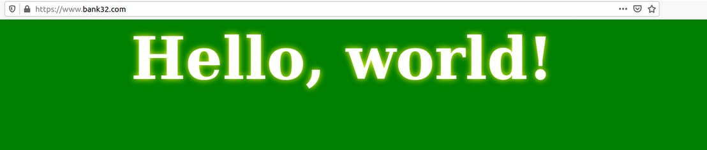

# Public-Key Infrastructure (PKI)

Public-key cryptography is the foundation of today's secure communication, but it is subject to man-in-the-middle attacks when one side of communication sends it's public key to the other side. PKI helps to verify the ownership of a public key, ensuring that the public key is indeed owned by the claimed owner.

## Lab Enviroment

For the lab we are going to use the docker-compose given in the labsetub of seed-labs to build up our application. Next, we are going to setup the DNS in /etc/hosts, 10.9.0.80 will be www.bank32.com.

## Task 1: Becoming a Certificate Authority (CA)

In this task we will become a root CA and generate a certificate for this CA. 

We start following the orders in the pdf, so we can generated de ca.key and ca.crt files.

First command
```
[12/23/22]seed@VM:~/.../Labsetup$ openssl req -x509 -newkey rsa:4096 -sha256 -days 3650 -keyout ca.key -out ca.crt
Generating a RSA private key
............................................................++++
....++++
writing new private key to 'ca.key'
Enter PEM pass phrase:
Verifying - Enter PEM pass phrase:
-----
You are about to be asked to enter information that will be incorporated
into your certificate request.
What you are about to enter is what is called a Distinguished Name or a DN.
There are quite a few fields but you can leave some blank
For some fields there will be a default value,
If you enter '.', the field will be left blank.
-----
Country Name (2 letter code) [AU]:PT
State or Province Name (full name) [Some-State]:Porto
Locality Name (eg, city) []:Porto
Organization Name (eg, company) [Internet Widgits Pty Ltd]:FEUP
Organizational Unit Name (eg, section) []:FSI
Common Name (e.g. server FQDN or YOUR name) []:serverfsi
Email Address []:
```

Second command
```
[12/23/22]seed@VM:~/.../Labsetup$ openssl x509 -in ca.crt -text -noout
Certificate:
    Data:
        Version: 3 (0x2)
        Serial Number:
            1e:d5:de:de:a0:6d:6a:63:1b:d3:03:83:5d:74:28:d1:19:11:98:af
        Signature Algorithm: sha256WithRSAEncryption
        Issuer: C = PT, ST = Porto, L = Porto, O = FEUP, OU = FSI, CN = serverfsi
        Validity
            Not Before: Dec 23 20:30:28 2022 GMT
            Not After : Dec 20 20:30:28 2032 GMT
        Subject: C = PT, ST = Porto, L = Porto, O = FEUP, OU = FSI, CN = serverfsi
        Subject Public Key Info:
            Public Key Algorithm: rsaEncryption
                RSA Public-Key: (4096 bit)
                Modulus:
                    00:a3:e5:78:37:c1:47:fd:89:0f:02:fb:f2:68:4b:
                    45:87:26:2b:56:eb:73:6e:8f:fc:65:ce:a6:3b:d8:
                    e2:f7:2e:18:41:15:6f:d5:d4:8a:56:1c:48:97:46:
                    6f:f7:b0:ee:6b:42:93:fd:84:ff:17:a3:83:d8:10:
                    68:d7:00:a0:2f:87:ef:90:c4:98:9d:a0:bb:49:b5:
                    d3:b7:c0:5e:19:88:09:42:80:ff:64:80:cc:a0:29:
                    9b:91:e6:72:21:04:0e:3b:0f:2d:81:2c:3d:1f:a1:
                    30:6e:7a:5a:60:21:7d:a4:fa:bf:75:c5:f1:6c:94:
                    b4:ee:57:7e:d3:6b:a9:1a:f9:45:43:d0:5f:93:c1:
                    82:5e:a9:dc:9d:e5:17:07:a6:d3:4a:29:d7:7c:31:
                    0f:36:c6:63:f1:9e:65:9a:23:64:f0:a3:d6:b4:e2:
                    2f:7f:26:cd:36:f5:5d:11:ae:a3:96:a3:c7:30:f6:
                    42:c6:37:40:29:11:12:5a:a7:95:b4:b2:70:53:42:
                    a2:c8:4b:44:7b:21:97:4c:62:d3:61:d4:9a:be:dc:
                    63:6d:95:df:23:e7:0d:de:9e:44:47:22:8e:ba:f1:
                    ac:ef:4c:88:3f:17:6d:da:5a:bc:c4:3c:10:46:a9:
                    3c:41:49:09:4e:6e:ec:f7:dd:60:5e:f8:be:87:25:
                    c1:7a:d8:ec:d6:e2:be:2a:e2:c8:b8:b1:fc:77:d0:
                    e2:eb:1c:b2:e3:a7:fc:e6:95:d0:e4:dd:f9:fb:0a:
                    5f:1b:d8:c5:60:87:5f:d4:7a:4e:b4:6f:9f:a9:8b:
                    ec:c3:94:80:f6:ac:5f:1a:12:7b:c1:25:72:48:28:
                    87:de:f3:cf:c7:b1:ee:27:ea:81:8e:6e:9f:ad:f7:
                    29:30:49:3c:fb:6d:cf:c0:e6:d4:17:1f:89:e0:2f:
                    24:d1:b9:45:8d:c1:3a:36:22:99:51:28:31:65:2c:
                    85:c4:2f:7d:e5:60:d2:b0:c4:16:4a:c9:32:25:a9:
                    21:01:0c:dd:65:5a:8e:69:ad:4b:d2:e7:5d:55:68:
                    69:7a:83:d6:f6:8e:1f:90:cd:75:e3:5d:c3:79:e2:
                    aa:56:1c:d0:e6:ea:7c:eb:d6:1a:1f:a1:a7:65:db:
                    9e:ac:d2:31:29:81:0e:38:e8:08:80:24:6b:8c:82:
                    8b:11:4f:98:87:1e:3d:a5:3c:f7:70:6f:8b:79:01:
                    6e:fb:9a:fc:0d:ce:82:f6:44:a2:99:8c:43:af:ee:
                    68:17:81:57:5e:a2:ac:f5:0e:34:b4:48:d1:93:c1:
                    dc:c2:4b:7c:3c:34:04:14:dc:c5:00:7c:88:97:a8:
                    e1:e6:6d:12:5d:ba:5c:d3:0d:63:ed:1a:45:6b:36:
                    9e:6e:a1
                Exponent: 65537 (0x10001)
        X509v3 extensions:
            X509v3 Subject Key Identifier: 
                8A:05:EF:A4:A4:4B:7F:3C:F3:32:2D:F2:03:7C:8C:95:87:21:9F:74
            X509v3 Authority Key Identifier: 
                keyid:8A:05:EF:A4:A4:4B:7F:3C:F3:32:2D:F2:03:7C:8C:95:87:21:9F:74

            X509v3 Basic Constraints: critical
                CA:TRUE
    Signature Algorithm: sha256WithRSAEncryption
         52:e8:35:fa:a2:ee:d9:ef:c1:4c:27:f9:46:0f:81:0a:35:3d:
         5d:fc:81:9e:96:5c:84:00:70:d9:bb:f0:92:45:57:28:73:61:
         dd:cd:2f:a2:ad:b2:fc:d8:db:67:34:7e:cd:bd:94:4b:0a:ad:
         56:0d:c7:d4:ad:d5:3a:fb:50:23:14:86:14:25:ee:54:a4:4a:
         3d:0e:24:b0:b0:62:ec:f8:2e:62:45:a8:29:c1:10:27:57:06:
         9f:c4:14:ae:d8:72:ff:43:78:01:61:9c:5f:e7:53:3a:18:2b:
         fb:2e:34:5c:db:68:95:4e:9f:3c:e7:e8:d5:bb:46:84:0d:6a:
         0d:ab:08:29:32:34:82:22:bc:af:1d:a9:04:f5:cf:43:8b:15:
         19:02:d0:08:9c:4a:a5:2c:11:cb:c0:91:de:67:c6:3a:3d:b1:
         41:f2:d1:25:67:48:fa:21:8e:67:4d:88:65:62:bc:fa:aa:6a:
         73:73:78:07:4c:dd:b4:8b:81:8f:93:24:8a:86:e9:3c:7c:ac:
         10:f9:5e:3a:ab:74:ad:26:46:37:a7:c2:1f:9e:8e:62:46:d4:
         2b:7c:59:ba:b8:17:9a:34:0c:64:94:24:0d:ee:78:bc:e8:8a:
         82:fc:3a:39:e1:b2:57:ff:6f:f3:de:fe:36:14:6d:97:2f:c0:
         79:7c:a8:e8:37:75:5e:b5:af:1f:49:e5:15:fd:12:52:7c:d7:
         06:2e:72:b6:0a:33:d1:f6:af:cc:08:1d:0b:8f:0e:33:d7:e5:
         b4:64:6e:7f:7b:ed:35:7a:b3:af:dc:6a:ff:a4:5f:34:76:c4:
         7b:3a:51:4c:1f:b4:e5:9d:b0:fb:92:b5:9d:1e:69:ea:b3:39:
         8c:8d:84:af:9e:5e:64:db:20:fa:a4:e2:3d:3f:a8:34:78:7d:
         6a:66:17:e0:2e:58:b7:3c:da:d2:78:18:ea:c2:7c:8f:f5:ea:
         27:f5:63:67:0a:80:f5:ac:9b:13:d9:fb:4b:b5:dc:ba:97:eb:
         3c:84:b4:dd:1c:68:a3:4f:21:80:b4:fa:73:6a:10:f8:46:12:
         18:5f:30:98:ec:f6:84:0b:29:4e:1c:23:63:54:ad:45:fe:d9:
         f0:b9:11:da:56:95:6d:77:c9:97:e4:8e:37:46:a4:78:0e:33:
         8d:12:23:6a:12:98:d5:10:e9:40:d5:f6:29:d9:95:21:ef:7f:
         9f:f0:93:dc:7f:94:90:a9:2a:35:a7:e3:cb:42:4a:b2:72:39:
         93:79:a4:7d:0b:53:44:fa:29:56:6e:6d:c5:89:72:66:d4:f1:
         6c:80:b3:64:1b:d7:1a:f5:43:24:e1:08:c1:68:6e:0e:60:96:
         b2:46:77:81:00:9d:51:85
```

Third command
```
[12/23/22]seed@VM:~/.../Labsetup$ openssl rsa -in ca.key -text -noout
Enter pass phrase for ca.key:
RSA Private-Key: (4096 bit, 2 primes)
modulus:
    00:a3:e5:78:37:c1:47:fd:89:0f:02:fb:f2:68:4b:
    45:87:26:2b:56:eb:73:6e:8f:fc:65:ce:a6:3b:d8:
    e2:f7:2e:18:41:15:6f:d5:d4:8a:56:1c:48:97:46:
    6f:f7:b0:ee:6b:42:93:fd:84:ff:17:a3:83:d8:10:
    68:d7:00:a0:2f:87:ef:90:c4:98:9d:a0:bb:49:b5:
    d3:b7:c0:5e:19:88:09:42:80:ff:64:80:cc:a0:29:
    9b:91:e6:72:21:04:0e:3b:0f:2d:81:2c:3d:1f:a1:
    30:6e:7a:5a:60:21:7d:a4:fa:bf:75:c5:f1:6c:94:
    b4:ee:57:7e:d3:6b:a9:1a:f9:45:43:d0:5f:93:c1:
    82:5e:a9:dc:9d:e5:17:07:a6:d3:4a:29:d7:7c:31:
    0f:36:c6:63:f1:9e:65:9a:23:64:f0:a3:d6:b4:e2:
    2f:7f:26:cd:36:f5:5d:11:ae:a3:96:a3:c7:30:f6:
    42:c6:37:40:29:11:12:5a:a7:95:b4:b2:70:53:42:
    a2:c8:4b:44:7b:21:97:4c:62:d3:61:d4:9a:be:dc:
    63:6d:95:df:23:e7:0d:de:9e:44:47:22:8e:ba:f1:
    ac:ef:4c:88:3f:17:6d:da:5a:bc:c4:3c:10:46:a9:
    3c:41:49:09:4e:6e:ec:f7:dd:60:5e:f8:be:87:25:
    c1:7a:d8:ec:d6:e2:be:2a:e2:c8:b8:b1:fc:77:d0:
    e2:eb:1c:b2:e3:a7:fc:e6:95:d0:e4:dd:f9:fb:0a:
    5f:1b:d8:c5:60:87:5f:d4:7a:4e:b4:6f:9f:a9:8b:
    ec:c3:94:80:f6:ac:5f:1a:12:7b:c1:25:72:48:28:
    87:de:f3:cf:c7:b1:ee:27:ea:81:8e:6e:9f:ad:f7:
    29:30:49:3c:fb:6d:cf:c0:e6:d4:17:1f:89:e0:2f:
    24:d1:b9:45:8d:c1:3a:36:22:99:51:28:31:65:2c:
    85:c4:2f:7d:e5:60:d2:b0:c4:16:4a:c9:32:25:a9:
    21:01:0c:dd:65:5a:8e:69:ad:4b:d2:e7:5d:55:68:
    69:7a:83:d6:f6:8e:1f:90:cd:75:e3:5d:c3:79:e2:
    aa:56:1c:d0:e6:ea:7c:eb:d6:1a:1f:a1:a7:65:db:
    9e:ac:d2:31:29:81:0e:38:e8:08:80:24:6b:8c:82:
    8b:11:4f:98:87:1e:3d:a5:3c:f7:70:6f:8b:79:01:
    6e:fb:9a:fc:0d:ce:82:f6:44:a2:99:8c:43:af:ee:
    68:17:81:57:5e:a2:ac:f5:0e:34:b4:48:d1:93:c1:
    dc:c2:4b:7c:3c:34:04:14:dc:c5:00:7c:88:97:a8:
    e1:e6:6d:12:5d:ba:5c:d3:0d:63:ed:1a:45:6b:36:
    9e:6e:a1
publicExponent: 65537 (0x10001)
privateExponent:
    2b:41:b8:2d:f6:fc:5a:25:1f:6a:29:36:fc:61:c9:
    72:f7:16:ff:34:db:5d:75:f1:26:a9:98:e4:38:c5:
    06:7a:0a:fa:ba:7e:ae:d0:0e:c6:d5:66:2f:4e:ee:
    e4:4f:b5:4d:67:e0:09:4c:5d:cb:4e:63:d0:d5:db:
    e5:cb:0b:7c:20:03:91:90:e1:ba:d0:9e:3d:c1:18:
    a4:e9:c7:ac:33:64:46:42:27:a5:cd:fc:b3:d4:e7:
    73:65:7f:ff:c8:c3:3c:c1:2f:c0:64:fd:a8:e8:71:
    10:e7:88:0c:d1:2a:09:2e:08:f4:3b:8f:11:9a:59:
    fa:81:eb:3e:3f:ae:fd:28:87:28:73:c9:96:04:bf:
    b4:de:5e:14:ea:4e:de:bd:20:0c:f5:e8:22:a6:0c:
    1e:e7:d3:9f:04:b0:4a:33:47:43:df:ea:1e:09:88:
    81:a5:ab:09:f3:4e:62:09:56:b1:be:7e:27:25:07:
    d0:aa:ea:6b:2c:4f:4c:cf:e8:4a:2d:c2:49:a7:4f:
    b1:4f:74:3e:8f:4a:10:66:10:e6:44:27:a7:72:21:
    67:dd:e3:6b:e5:62:9a:bb:e8:c7:61:8e:8c:36:96:
    ee:fd:a3:04:0b:d9:f9:84:73:47:d3:96:74:1f:dc:
    80:5a:97:73:35:01:a4:15:b0:86:c0:5e:00:eb:6d:
    19:e4:08:97:50:87:40:a5:ef:7c:e8:bf:b9:e4:94:
    cb:25:47:68:50:ee:12:12:34:c1:0a:36:14:fa:26:
    83:14:08:b7:20:69:f4:1b:f0:7e:18:6a:c3:0d:57:
    00:b4:25:b6:00:91:7d:51:1c:1b:67:9c:41:20:57:
    46:81:1c:7a:b9:11:f6:eb:4a:70:d6:30:dd:f1:40:
    7d:9a:54:10:84:a8:d2:fa:1d:26:32:8a:e1:8a:cb:
    76:e4:76:cd:43:24:7a:61:54:42:20:db:aa:e0:bb:
    8a:38:56:cd:af:0f:e8:3c:5c:6e:4f:b8:6f:9f:dc:
    80:08:03:e0:fd:d2:0e:6f:ef:88:5e:68:87:b7:dc:
    94:77:ce:7b:6f:c4:cc:d4:86:0d:74:1d:de:03:68:
    48:64:71:38:23:b9:c6:cd:67:5d:52:ea:66:a1:82:
    0a:54:40:02:7f:5f:28:68:01:39:8d:c8:95:b3:1f:
    bf:0e:0e:b4:59:e9:28:0a:fb:41:cf:65:c6:fc:33:
    1b:af:cb:af:4b:65:06:df:1c:a0:a6:1f:62:51:8b:
    36:38:9d:2a:8f:85:e2:35:23:47:83:59:24:ff:9c:
    4d:ba:85:38:3f:7c:9f:3c:bb:6e:5a:b0:b8:48:19:
    39:0e:b7:1d:52:0d:ba:ab:7e:2d:50:b5:a5:ea:f7:
    3c:31
prime1:
    00:d5:9e:d1:cf:c2:a7:c9:9c:52:4f:0e:0d:4c:82:
    1c:76:e3:97:9a:08:e8:47:f3:ca:48:6f:4f:93:a0:
    76:11:d7:78:d6:8b:b4:e0:1a:4b:23:37:85:f0:65:
    7a:cd:90:b0:4b:4f:36:24:90:e0:29:51:a4:60:ea:
    69:2d:be:35:4e:7c:0c:51:c9:34:5a:af:6e:f5:41:
    9e:5a:24:f4:a2:1d:f9:a2:3c:c2:90:9f:4e:86:b8:
    bc:f0:5c:8f:0b:a5:c4:93:81:95:75:0c:89:91:76:
    5e:23:92:f8:80:e1:29:76:ce:48:14:c7:97:22:0d:
    f1:12:99:37:2c:86:a0:78:38:91:2d:5d:bd:fc:d6:
    03:f3:1d:57:f4:a4:68:81:f8:b6:d1:94:aa:1b:f4:
    a0:c1:1c:41:36:ea:75:c3:e0:6e:47:5a:8c:d4:48:
    ec:55:8f:ca:6b:b7:eb:b5:3e:5d:e0:34:2e:ba:7f:
    ae:02:f3:e9:62:18:f3:81:08:13:31:33:0d:74:3d:
    6f:f9:13:9b:83:ea:1c:ab:b2:71:a3:06:c9:48:c4:
    af:cd:af:92:5b:7e:a6:ff:44:36:b7:32:a9:a7:3b:
    98:a3:3f:5b:9c:63:0b:0e:1d:c6:54:3f:ec:77:2b:
    95:e2:3d:bf:04:df:88:dd:bd:eb:3a:d4:44:1c:bc:
    d2:d5
prime2:
    00:c4:69:4e:6c:25:46:9b:5e:87:dc:72:61:65:45:
    cd:00:f8:9c:4f:b0:aa:c0:ab:fe:32:a1:38:fa:fe:
    17:c6:7d:05:68:61:53:2e:ce:20:51:da:fb:6c:5f:
    c0:8d:a7:cb:bd:77:b3:76:e7:02:24:41:8b:6c:ad:
    26:8e:98:f7:8e:0b:a5:52:ee:7d:43:77:6a:35:26:
    c4:f0:35:73:a4:0d:e6:8a:b2:b4:c7:7f:1a:63:2f:
    be:c4:4c:07:0a:ec:06:15:15:b2:e4:54:07:b8:26:
    b9:7a:35:75:83:41:6a:77:8e:45:b0:3f:0d:bf:08:
    4a:17:2f:f6:90:9d:3c:30:cc:63:7c:9f:8c:fe:bb:
    04:f3:ee:92:3c:d3:f7:01:57:67:73:39:91:c9:e6:
    fb:3f:c4:bd:c8:43:9c:c9:36:96:b9:11:fe:6e:24:
    74:64:f9:7b:27:5e:71:ea:59:09:6e:78:0d:14:77:
    65:c2:56:95:4a:28:b8:7b:22:93:81:a2:2a:04:2f:
    aa:e0:91:18:11:5f:e1:3f:41:87:ff:7f:3a:ab:4c:
    87:f4:40:b9:f5:be:49:28:be:6d:29:2e:30:cb:2d:
    63:de:82:d7:6f:6e:f9:1f:42:a4:b3:dd:2c:c5:ea:
    19:30:b5:91:88:c3:26:ad:51:d7:52:e2:70:7c:89:
    9a:9d
exponent1:
    7e:6e:55:37:65:b9:f0:b5:38:71:d9:9b:3d:60:f4:
    7f:d9:0b:ec:fa:c0:9f:75:46:8f:c0:71:94:aa:2f:
    b7:37:94:29:46:de:72:94:9d:4b:e6:9c:bb:3f:14:
    83:7d:d3:19:7f:74:48:08:06:e3:ed:92:20:5a:1c:
    8e:1a:39:6a:8e:38:ac:5f:2d:41:4e:fb:98:e4:91:
    58:40:ef:18:d4:2c:df:3c:9e:db:01:ae:74:45:fa:
    6d:38:1a:e1:85:e6:e6:76:97:82:83:3d:18:7e:ba:
    10:cb:f7:90:2f:b3:5e:c1:90:1f:dc:51:32:b2:95:
    af:b0:46:db:6f:82:a2:24:b8:a7:e5:07:81:11:19:
    9d:56:0c:ac:9a:71:d0:1a:e7:f8:fa:c8:03:6b:b1:
    89:19:b3:ef:50:ad:0a:95:56:2f:9d:04:24:d0:54:
    2f:ff:be:8a:2a:7c:b2:f4:8a:93:1b:cf:5c:4a:1d:
    2f:5a:35:12:fe:39:80:70:cb:0b:1f:70:23:10:09:
    a9:9d:55:39:a9:e1:f6:2c:d2:dc:ee:33:4b:82:3d:
    9a:bb:03:20:6b:c1:62:eb:78:86:cc:d1:64:4c:fd:
    76:01:15:b3:65:5b:31:ab:a5:aa:4f:7b:20:bd:07:
    24:b3:ee:ce:6f:8e:8d:ce:cd:de:2f:ab:70:66:c1:
    51
exponent2:
    79:35:73:8c:11:c4:ed:04:fd:5a:f1:cb:61:30:1e:
    3f:47:2d:4f:90:7b:0f:c4:14:6f:32:47:73:bd:72:
    f6:af:18:b3:3d:bc:93:d9:e8:e0:1a:ff:a5:f5:c1:
    62:a9:f6:75:ca:75:1a:1f:9d:96:ba:4c:4c:98:de:
    7e:89:af:dc:1d:1b:bd:7e:28:17:86:8e:28:96:f0:
    5a:3c:e2:4c:8f:b7:82:48:9e:7f:ae:d4:9d:f9:4d:
    04:de:d6:49:cb:36:45:b4:ca:5d:55:ee:1d:9a:e8:
    43:9e:d2:12:5a:40:55:df:9a:ea:15:3f:6a:70:b7:
    28:70:14:fd:51:cb:5f:62:02:d3:59:b3:2d:50:44:
    d2:34:9c:52:a5:8c:7d:6b:6f:10:10:ab:03:aa:63:
    cb:0a:a3:03:ff:95:b6:26:d6:05:08:31:b7:cf:0f:
    75:70:f0:ab:6f:01:65:d9:e4:94:23:ca:0e:a3:50:
    4d:0a:19:bf:56:39:e2:e3:87:9c:2c:73:39:7a:21:
    3d:cc:cc:c9:8c:1d:f9:67:7b:82:15:06:23:c8:6a:
    ee:35:33:8d:90:0c:9d:f4:46:71:6f:6b:f5:36:e1:
    b6:e3:90:07:d8:b8:2c:ae:77:ed:f7:c4:35:af:2e:
    34:7d:18:7f:09:cf:c8:8e:05:0f:c5:66:1d:b4:dd:
    91
coefficient:
    58:02:00:3b:e5:82:fd:2e:a4:d9:23:be:8c:62:f8:
    98:bc:98:74:3f:3d:f9:b3:c4:59:a1:1e:85:a1:33:
    56:ab:a6:73:a0:9a:02:6b:b0:8f:36:1c:05:23:72:
    cb:73:10:a6:d4:d8:49:ed:13:22:11:d3:5b:41:90:
    b1:0c:79:19:c0:c5:51:48:44:7c:ce:fc:6b:bf:2b:
    cd:9f:96:be:b5:80:fd:75:95:be:da:6f:f9:55:76:
    04:1b:db:07:0f:04:ed:10:29:25:38:a4:de:69:93:
    09:fe:bb:17:8a:3b:9f:ab:68:fa:9f:69:8d:bc:6f:
    99:57:8c:a9:3a:32:af:34:49:41:65:b8:3a:70:95:
    5c:75:3c:3e:2d:f0:28:b9:fa:fc:90:c8:ab:ba:7f:
    64:7f:8c:f7:0f:6c:41:c6:b8:9e:79:8d:61:2c:59:
    50:8a:f9:4c:e7:47:f7:d4:2d:3a:da:8e:6d:b7:04:
    4f:1e:c6:3f:0b:b1:33:2e:4a:ef:82:ed:5b:fd:c2:
    c4:c8:a2:bc:9d:f0:f8:25:68:57:71:f0:4c:a2:80:
    3a:f3:2e:0a:c6:22:f1:6d:80:c1:e3:90:80:cd:54:
    58:44:5b:ef:1f:b6:88:62:91:ab:6d:16:9a:ed:bb:
    7a:04:d8:16:35:f4:06:26:5e:bb:4d:a8:dc:cf:c3:
    a6
```

Questions

1. In the ca.crt, the key CA: TRUE indicates that it is a CA's certificate (2nd command output).
2. The key X509v3 Subject Key Identifier and the key X509v3 Authority Key Identifier are the same, so, that indicates this is a self-signed certificate (2nd command output).
3. In the certificate, e is the "publicExponent: 65537 (0x10001)", d is the "privateExponent: ", n is the "modulus: ", p is "prime1 " and q is "prime2 " (we can see their values after running 3rd command - output).

## Task 2: Generating a Certificate Request for Your Web Server

In this task, we generated a Certificate Signing Request (CSR) to www.bank32.com, generating the files server.key e server.csr. After that, we add other two alternative names to the certificate "www.bank32A.com" and "www.bank32B.com"

We run the first command
```
[12/23/22]seed@VM:~/.../Labsetup$ openssl req -newkey rsa:2048 -sha256 -keyout server.key -out server.csr -subj "/CN=www.bank32.com/O=Bank32 Inc./C=US" -passout pass:dees
Generating a RSA private key
.+++++
.........................+++++
writing new private key to 'server.key'
-----
```

Then, second command
(server.csr)
```
[12/23/22]seed@VM:~/.../Labsetup$ openssl req -in server.csr -text -noout
Certificate Request:
    Data:
        Version: 1 (0x0)
        Subject: CN = www.bank32.com, O = Bank32 Inc., C = US
        Subject Public Key Info:
            Public Key Algorithm: rsaEncryption
                RSA Public-Key: (2048 bit)
                Modulus:
                    00:d5:ed:22:52:04:51:4c:71:01:b2:41:70:df:60:
                    a6:85:77:3c:ce:58:14:ce:99:cc:cf:bb:49:25:57:
                    da:0e:01:d5:76:4b:c0:7c:43:19:8c:33:8b:c1:41:
                    2d:69:00:0a:96:09:47:a0:a7:b2:4f:6f:19:e1:f6:
                    b2:9e:df:28:4d:ca:b3:8f:d8:24:eb:bf:7e:cb:dd:
                    8f:b6:04:16:22:96:03:bf:23:07:f2:16:6d:ba:ff:
                    e5:4a:25:c4:be:3c:18:b7:3e:82:60:5d:fe:51:77:
                    60:a8:38:fa:b1:3a:d0:bc:40:59:2a:cb:36:9c:b7:
                    16:27:5b:fe:13:3f:32:47:7f:56:1d:8e:cc:e2:0e:
                    3c:ae:29:39:24:2f:48:27:24:9b:ab:08:cf:34:f6:
                    8b:f6:86:e0:41:0b:db:94:53:33:57:ae:70:c3:46:
                    9e:38:b1:c6:dd:7a:a8:40:6d:d2:10:2c:57:4d:20:
                    04:c6:cd:11:97:b3:71:b7:45:8a:be:bf:e9:4d:af:
                    2f:ea:65:22:d2:bc:d6:92:35:2f:5f:51:01:65:8d:
                    a4:17:59:19:91:fa:99:2f:92:2b:0e:d7:dc:f3:40:
                    38:ff:07:05:e5:85:16:9a:34:fa:a2:30:dd:7b:48:
                    b7:a2:30:66:0c:c7:b2:85:d7:dc:0d:98:71:6b:5c:
                    f5:bd
                Exponent: 65537 (0x10001)
        Attributes:
            a0:00
    Signature Algorithm: sha256WithRSAEncryption
         63:ba:d5:0d:b5:2d:db:bf:4d:ab:a0:90:9d:8d:b2:5d:87:71:
         2b:f3:ea:0d:a8:2d:c4:a8:21:87:d0:55:e1:20:ef:03:70:ee:
         ff:bb:3d:1b:b7:00:ee:27:fe:f2:1e:a0:db:b6:b6:70:a3:04:
         ad:f8:cf:db:52:7c:7b:2c:cf:00:42:2b:24:85:25:43:56:32:
         f1:97:6e:5c:30:70:39:19:74:eb:5a:4c:87:57:67:33:10:4f:
         de:69:e8:d1:90:07:f1:bc:20:2c:22:ef:93:b4:65:45:7e:46:
         68:3a:cd:5d:17:0d:fc:49:7a:0a:c9:96:0c:fc:1c:02:e3:23:
         f1:52:05:98:72:0e:83:c9:b9:cf:2b:93:f3:0c:6b:83:df:60:
         b5:1d:2f:33:05:9a:35:a0:89:ea:31:b0:be:c2:ee:40:53:d6:
         23:bf:f9:d9:09:73:86:cc:a7:3a:ef:17:d1:17:cf:f2:9d:a3:
         6a:92:3f:5b:87:2a:7b:1e:b7:e3:a3:9a:66:dc:2c:23:bf:22:
         d3:29:25:91:b5:28:ea:3b:06:50:3d:dd:00:e7:48:a9:06:34:
         51:ae:90:64:93:d8:2b:65:e8:80:51:c6:69:62:cb:ff:bb:02:
         a0:30:39:07:c2:a5:16:e4:b8:52:0f:90:aa:29:48:29:5b:f1:
         5b:ad:27:2c
```

Third command
(server.key)
```
[12/23/22]seed@VM:~/.../Labsetup$ openssl rsa -in server.key -text -noout
Enter pass phrase for server.key:
RSA Private-Key: (2048 bit, 2 primes)
modulus:
    00:d5:ed:22:52:04:51:4c:71:01:b2:41:70:df:60:
    a6:85:77:3c:ce:58:14:ce:99:cc:cf:bb:49:25:57:
    da:0e:01:d5:76:4b:c0:7c:43:19:8c:33:8b:c1:41:
    2d:69:00:0a:96:09:47:a0:a7:b2:4f:6f:19:e1:f6:
    b2:9e:df:28:4d:ca:b3:8f:d8:24:eb:bf:7e:cb:dd:
    8f:b6:04:16:22:96:03:bf:23:07:f2:16:6d:ba:ff:
    e5:4a:25:c4:be:3c:18:b7:3e:82:60:5d:fe:51:77:
    60:a8:38:fa:b1:3a:d0:bc:40:59:2a:cb:36:9c:b7:
    16:27:5b:fe:13:3f:32:47:7f:56:1d:8e:cc:e2:0e:
    3c:ae:29:39:24:2f:48:27:24:9b:ab:08:cf:34:f6:
    8b:f6:86:e0:41:0b:db:94:53:33:57:ae:70:c3:46:
    9e:38:b1:c6:dd:7a:a8:40:6d:d2:10:2c:57:4d:20:
    04:c6:cd:11:97:b3:71:b7:45:8a:be:bf:e9:4d:af:
    2f:ea:65:22:d2:bc:d6:92:35:2f:5f:51:01:65:8d:
    a4:17:59:19:91:fa:99:2f:92:2b:0e:d7:dc:f3:40:
    38:ff:07:05:e5:85:16:9a:34:fa:a2:30:dd:7b:48:
    b7:a2:30:66:0c:c7:b2:85:d7:dc:0d:98:71:6b:5c:
    f5:bd
publicExponent: 65537 (0x10001)
privateExponent:
    5c:b6:98:20:39:94:ce:6f:4f:8f:e4:c2:b9:5c:d6:
    ee:92:fd:bc:63:fa:28:8c:09:72:a2:35:92:44:9f:
    d1:60:44:16:2f:c0:6d:5a:5b:51:22:e9:d7:c8:9a:
    98:9e:16:f8:6d:6f:28:96:65:35:fd:ed:96:bb:e7:
    2f:e9:81:3b:2d:b5:62:8b:07:7d:50:91:f0:62:c6:
    ac:d8:da:8b:04:be:fc:f0:7e:ba:11:b4:5e:ce:16:
    9e:6a:fd:f8:80:6d:29:c5:a2:95:87:46:f8:21:a7:
    b7:60:72:6d:ab:12:d9:f3:7d:71:89:7e:d2:ae:9a:
    a0:56:43:28:2e:44:69:2d:60:1d:52:7d:77:c0:9a:
    de:07:39:e3:1b:b5:06:23:d7:40:d7:f8:d1:69:0f:
    8e:ea:a4:32:8e:c3:ae:c1:7e:23:7e:e1:43:2e:45:
    f6:96:05:3d:59:94:cb:87:96:4e:a4:99:b9:25:8b:
    58:22:fe:ab:37:7d:1a:92:0d:c6:31:93:9a:4b:0a:
    21:ea:cb:cc:fd:e8:a6:92:30:8a:08:5a:6a:09:30:
    f4:0c:59:27:34:a9:47:3c:9c:b6:09:d9:a1:b6:1a:
    5e:0c:43:d4:bd:d7:22:50:fb:e3:33:62:e9:07:e1:
    01:8c:17:b4:2a:47:41:7b:98:b5:41:92:36:22:06:
    75
prime1:
    00:fe:ce:f5:87:c2:4b:91:cf:01:22:76:40:54:ed:
    85:47:90:b4:a8:b4:73:47:59:cf:be:20:f0:c2:e0:
    33:c4:d0:08:64:8b:45:5d:03:4e:c9:1a:01:80:50:
    5a:81:bb:f7:de:57:88:23:c0:5a:fc:76:a1:b0:8d:
    82:8c:75:a9:36:ca:46:69:ca:c4:76:7f:9a:17:5a:
    e1:56:f1:59:db:c9:0d:d7:18:81:fe:2c:2c:d5:4e:
    c4:ea:77:9f:79:52:f0:01:5a:7d:d9:33:a3:39:d8:
    62:3c:c9:d8:e8:15:cc:7c:c9:24:99:10:18:22:c1:
    84:fa:85:5f:2c:bc:66:b3:13
prime2:
    00:d6:ed:3b:c0:6b:e9:66:7b:bd:ab:da:4f:07:65:
    d9:dd:82:c9:f4:80:b1:b1:e7:d6:88:b6:0a:26:4f:
    09:f6:a3:25:c4:18:5a:de:f9:c6:23:25:8e:48:0f:
    41:e7:75:84:b1:f1:51:92:78:37:21:1f:ae:0e:b1:
    8d:58:12:74:f7:ae:67:b7:2e:1f:13:6b:3a:fe:d8:
    32:02:56:af:7a:be:f1:24:18:a2:14:b9:13:e8:f5:
    86:21:51:7b:09:05:6a:82:09:27:1a:91:c3:2e:c8:
    c3:23:54:cf:fe:96:08:2a:dd:1c:31:7f:ca:7d:31:
    66:ea:5b:78:92:83:b6:fd:ef
exponent1:
    00:c6:4b:d5:74:53:56:70:20:82:a7:89:13:43:84:
    9c:e6:36:cd:01:45:7d:39:17:c1:be:1a:f0:83:17:
    eb:f1:cc:5b:db:b3:2e:c5:d5:df:28:4d:9e:c1:76:
    c7:18:93:69:b0:94:ba:13:e8:8c:66:51:04:3f:db:
    c0:af:02:9a:2f:53:77:3c:b9:59:ef:46:1a:6a:f6:
    84:cb:1e:84:69:b0:ab:9e:ab:29:ee:dd:fd:fd:fa:
    90:f0:4f:2b:c2:45:33:16:3a:90:19:ca:3f:ca:b2:
    84:b0:fd:fc:59:91:2d:54:27:4c:dd:f9:52:6f:29:
    df:0c:ff:62:33:f4:62:90:15
exponent2:
    52:3c:6b:84:70:c5:d9:84:b7:4a:2e:39:d6:e6:cd:
    b9:c7:f5:66:2c:67:d1:5e:97:e3:af:63:aa:cc:cb:
    4f:27:95:a7:b6:79:ee:9f:3b:84:ef:35:c5:b4:b0:
    ce:d3:54:76:91:93:58:ab:ce:cc:49:c6:db:b0:6c:
    18:aa:d7:3e:7d:e9:09:5a:08:61:f1:c1:9d:09:33:
    f9:59:19:c3:a9:93:b2:f0:09:f4:4b:ec:a6:52:6b:
    84:0c:1d:3b:92:6a:f2:5e:76:2b:e0:62:02:60:a6:
    e9:b9:e5:eb:cf:94:48:72:59:fb:46:9e:3f:d0:cb:
    44:18:c3:c5:ab:c8:34:d9
coefficient:
    62:c0:1f:48:ec:14:6f:e3:aa:4f:ac:59:20:ee:2b:
    53:24:d1:e0:b1:22:d3:12:05:02:b7:75:a2:a8:bf:
    ce:a5:a5:6e:90:85:a0:5f:47:89:db:ed:58:31:79:
    68:43:c1:72:26:b8:ff:79:6e:d3:5e:1b:74:c9:85:
    ef:ca:d0:39:59:a0:05:a3:40:e6:b7:48:83:e1:dc:
    af:6a:b0:95:90:ca:3e:51:a2:40:1a:4d:dc:80:77:
    56:a4:18:f6:81:05:d0:ff:72:57:61:53:7b:67:2c:
    a9:4e:e0:f9:75:93:c5:61:8e:38:8c:02:14:eb:43:
    9b:ee:8a:99:ac:f2:98:ba
```

Now, we add two alternative names
```
[12/23/22]seed@VM:~/.../Labsetup$ openssl req -newkey rsa:2048 -sha256 -keyout server.key -out server.csr -subj "/CN=www.bank32.com/O=Bank32 Inc./C=US" -passout pass:dees -addext "subjectAltName = DNS:www.bank32A.com, DNS:www.bank32B.com"
Generating a RSA private key
...............+++++
..............+++++
writing new private key to 'server.key'
-----
```

## Task 3: Generating a Certificate for your server

The CSR needs to have the CA's certificate. We will use our own trusted CA to generate the certificate.

We run this command
(server.csr to server.crt)
```
[12/23/22]seed@VM:~/.../Labsetup$ openssl ca -config openssl.cnf -policy policy_anything -md sha256 -days 3650 -in server.csr -out server.crt -batch -cert ca.crt -keyfile ca.key
Using configuration from openssl.cnf
Enter pass phrase for ca.key:
Check that the request matches the signature
Signature ok
Certificate Details:
        Serial Number: 4096 (0x1000)
        Validity
            Not Before: Dec 23 21:05:02 2022 GMT
            Not After : Dec 20 21:05:02 2032 GMT
        Subject:
            countryName               = US
            organizationName          = Bank32 Inc.
            commonName                = www.bank32.com
        X509v3 extensions:
            X509v3 Basic Constraints: 
                CA:FALSE
            Netscape Comment: 
                OpenSSL Generated Certificate
            X509v3 Subject Key Identifier: 
                2A:F4:04:32:CE:58:D6:19:2C:4A:CB:D9:58:6C:0B:89:9D:AF:99:DD
            X509v3 Authority Key Identifier: 
                keyid:8A:05:EF:A4:A4:4B:7F:3C:F3:32:2D:F2:03:7C:8C:95:87:21:9F:74

            X509v3 Subject Alternative Name: 
                DNS:www.bank32A.com, DNS:www.bank32B.com
Certificate is to be certified until Dec 20 21:05:02 2032 GMT (3650 days)

Write out database with 1 new entries
Data Base Updated
```

Then we run another command
(-> server.crt)
```
[12/23/22]seed@VM:~/.../Labsetup$ openssl x509 -in server.crt -text -noout
Certificate:
    Data:
        Version: 3 (0x2)
        Serial Number: 4096 (0x1000)
        Signature Algorithm: sha256WithRSAEncryption
        Issuer: C = PT, ST = Porto, L = Porto, O = FEUP, OU = FSI, CN = serverfsi
        Validity
            Not Before: Dec 23 21:05:02 2022 GMT
            Not After : Dec 20 21:05:02 2032 GMT
        Subject: C = US, O = Bank32 Inc., CN = www.bank32.com
        Subject Public Key Info:
            Public Key Algorithm: rsaEncryption
                RSA Public-Key: (2048 bit)
                Modulus:
                    00:c7:40:db:1c:62:76:6f:6a:63:7e:b5:31:cb:be:
                    b6:fc:39:27:f4:d2:ee:20:6b:75:f7:06:e1:c1:8d:
                    95:b0:87:88:7d:e9:20:af:fa:d6:3c:c0:12:81:96:
                    51:ed:54:62:9b:7b:59:7d:29:fa:4b:48:9f:ef:9c:
                    00:32:1c:8f:e3:2d:ca:9a:5a:d2:ef:5d:e6:4a:6e:
                    72:37:06:68:48:b0:6d:47:2e:ef:39:d3:75:4d:b9:
                    40:08:0d:bf:2b:d3:fc:f8:e4:ab:9a:2f:ad:a9:14:
                    a4:7a:4b:fd:5d:d7:da:5f:37:40:7d:19:20:84:68:
                    59:81:e7:f6:0c:f4:e2:26:7a:ae:52:17:00:da:23:
                    54:1d:8b:04:0d:4e:a5:bf:05:0e:d7:02:79:09:d3:
                    15:de:eb:1f:61:55:c3:9b:de:ba:e3:83:05:22:32:
                    11:93:25:67:71:26:74:13:1d:2a:83:ba:96:0c:3f:
                    43:cb:bc:4e:e6:bc:c8:71:cc:aa:d7:ce:f9:a1:26:
                    6a:bb:53:db:a7:df:50:88:7b:a2:43:bb:36:9f:2d:
                    28:56:dd:c9:09:1f:48:30:8e:ee:25:0b:68:54:db:
                    c0:ec:dd:37:68:36:41:e3:f9:0a:e5:77:fd:0c:45:
                    e9:d0:d7:2f:e6:98:71:86:aa:8d:fc:63:64:ad:b7:
                    5d:11
                Exponent: 65537 (0x10001)
        X509v3 extensions:
            X509v3 Basic Constraints: 
                CA:FALSE
            Netscape Comment: 
                OpenSSL Generated Certificate
            X509v3 Subject Key Identifier: 
                2A:F4:04:32:CE:58:D6:19:2C:4A:CB:D9:58:6C:0B:89:9D:AF:99:DD
            X509v3 Authority Key Identifier: 
                keyid:8A:05:EF:A4:A4:4B:7F:3C:F3:32:2D:F2:03:7C:8C:95:87:21:9F:74

            X509v3 Subject Alternative Name: 
                DNS:www.bank32A.com, DNS:www.bank32B.com
    Signature Algorithm: sha256WithRSAEncryption
         75:14:97:8e:74:af:b0:6f:e7:31:0a:34:4a:90:de:7f:00:60:
         64:31:e9:2b:ca:94:94:e2:f5:05:93:ef:2a:93:bc:2c:be:94:
         a4:5f:13:27:7c:85:f2:ce:7b:a3:e1:f7:cc:2c:b5:6c:19:40:
         72:67:40:64:ec:ca:b7:f2:06:28:0b:5b:1c:2c:c7:ae:7c:d6:
         a4:7c:3b:19:1b:f3:d3:e8:00:d6:a0:a6:4f:66:ef:fa:a4:c1:
         95:1d:3d:e1:c0:37:30:1e:4b:a4:73:05:f0:ef:ef:41:8f:f7:
         99:df:3b:f8:16:8f:79:a6:9d:1c:a2:a2:1b:00:56:3d:3e:32:
         2d:3c:f7:a1:f9:5a:b1:a6:59:b4:92:9b:26:dc:38:db:85:12:
         6f:2b:9d:0b:54:11:ee:99:d5:70:c0:09:0e:ce:f2:45:8b:c8:
         56:31:56:1f:f1:46:04:93:0d:2a:36:d3:ad:d6:7d:69:8a:2f:
         45:34:94:0a:6e:f1:2a:28:d8:e5:a4:9a:81:04:21:d0:92:d4:
         81:60:a4:60:ad:61:be:c2:68:5e:5d:40:cf:42:d5:0e:16:eb:
         29:aa:40:f3:ea:38:9a:b8:14:6f:5b:e2:60:f9:92:53:1f:30:
         9f:16:70:07:80:3e:f8:3a:42:3a:78:3e:a3:48:09:85:b9:2b:
         8f:5a:5a:2a:5d:67:a9:32:29:c0:4e:46:9f:86:10:e6:7e:0d:
         6b:ea:42:9e:83:67:8b:42:83:cd:37:2c:f0:56:f0:d2:a2:8d:
         a9:d6:1d:d8:75:6c:ed:37:93:df:b0:77:5c:ed:35:ab:ee:62:
         43:70:cb:fb:77:c6:2a:c8:63:14:c7:b4:9c:cd:92:67:40:fb:
         b8:75:e2:4d:ee:d1:b0:a0:df:9d:29:5c:09:8c:f7:1a:17:c1:
         de:71:a5:c0:d7:7f:a4:bd:f8:ab:5a:be:f6:35:e9:8b:d3:59:
         a2:b6:04:db:be:c2:6d:69:8b:b3:46:48:e4:96:9a:81:7d:3e:
         9e:be:67:75:5a:4b:c3:ff:8a:75:28:c0:87:17:bf:aa:01:e2:
         9b:8a:2c:71:fe:d2:49:62:c9:2a:16:f0:a0:92:60:81:87:ee:
         a9:04:9d:ef:75:90:f4:70:47:53:1c:0f:78:24:c0:ef:74:e0:
         be:3d:9b:66:34:40:bf:b2:3d:49:3a:ce:4f:5c:ee:e6:6d:3a:
         c0:62:51:5a:af:6b:4f:b0:dd:e8:e8:74:a1:65:39:a6:37:3b:
         5e:38:be:92:fa:a6:df:25:48:63:17:42:cf:d8:da:bf:e0:3c:
         c4:46:b8:77:33:94:41:76:10:d7:18:a5:9f:af:b5:ba:e0:dc:
         98:f2:2b:93:ba:b3:17:72
```
As we can check, the alternative names are included.

## Task 4: Deploying Certificate in an Apache-Based HTTPS Website

In this task, we will set up an HTTPS website based Apache.

To create it, we just need to configure the Apache server,
so it knows where to get the private key and certificates. 

We need the server.key and server.crt files in the volumes directory (the shared folder).

We save this contents in a file. 
```
<VirtualHost *:443> 
    DocumentRoot /var/www/bank32
    ServerName www.bank32.com
    ServerAlias www.bank32A.com
    ServerAlias www.bank32B.com
    ServerAlias www.bank32W.com
    DirectoryIndex index.html
    SSLEngine On 
    SSLCertificateFile /volumes/server.crt
    SSLCertificateKeyFile /volumes/server.key
</VirtualHost>

<VirtualHost *:80> 
    DocumentRoot /var/www/bank32
    ServerName www.bank32.com
    DirectoryIndex index_red.html
</VirtualHost>

# Set the following gloal entry to suppress an annoying warning message
ServerName localhost
```

The Dockerfile has commands that load the website and copy the configurations (the certificate and key to the /certs
folder of the container) from our file to the VirtualHost file, so that Apache knows where the server certificate and private key are stored.

Dockerfile
```
FROM handsonsecurity/seed-server:apache-php

ARG WWWDIR=/var/www/bank32

COPY ./index.html ./index_red.html $WWWDIR/
COPY ./bank32_apache_ssl.conf /etc/apache2/sites-available
COPY ./certs/bank32.crt ./certs/bank32.key  /certs/

RUN  chmod 400 /certs/bank32.key \
     && chmod 644 $WWWDIR/index.html \
     && chmod 644 $WWWDIR/index_red.html \
     && a2ensite bank32_apache_ssl   

CMD  tail -f /dev/null
```
We need to build and run the Dockerfile above.

Then, on another command shell, we run ```service apache2 start``` in our container (images_www), and we login.


After that, we try to access https://www.bank32.com and we get a warning from the browser. To solve this, we need to add our CA to the trusted authorities of the browser.



## Task 5: Launching a Man-In-The-Middle Attack

In this task, we did the same as in task4, but for twitter.com address.

Create VirtualHost.


```
<VirtualHost *:443> 
    DocumentRoot /var/www/bank32
    ServerName twitter.com
    DirectoryIndex index.html
    SSLEngine On 
    SSLCertificateFile /volumes/server.crt
    SSLCertificateKeyFile /volumes/server.key
</VirtualHost>

<VirtualHost *:80> 
    DocumentRoot /var/www/bank32
    ServerName twitter.com
    DirectoryIndex index_red.html
</VirtualHost>

# Set the following gloal entry to suppress an annoying warning message
ServerName localhost
```
We tried to access twitter.com, but as our certificate was not valid (was not associated with the website link), the page was not loaded, due to being considerate not secure, and then preventing the attack.

## Task 6: Launching a Man-In-The-Middle Attack with a Compromised CA

In order to successfully perform a Man-In-The-Middle attack, we need to create the certificate, so that we include the twitter.com address. This can be done with the following command:
```
[12/23/22]seed@VM:~/.../Labsetup$ openssl req -newkey rsa:2048 -sha256 -keyout server.key -out server.csr -subj "/CN=www.twitter.com/O=Twitter Inc./C=US" -passout pass:dees
Generating a RSA private key
..........................+++++
..................+++++
writing new private key to 'server.key'
-----
```
We also run this command
```
[12/23/22]seed@VM:~/.../Labsetup$ openssl ca -config myCA_openssl.cnf -policy policy_anything -md sha256 -days 3650 -in server.csr -out server.crt -batch -cert ca.crt -keyfile ca.key
```
We restart the server with the new certificates and update the ssl file with the new configurations.
```
<VirtualHost *:443> 
    DocumentRoot /var/www/bank32
    ServerName twitter.com
    DirectoryIndex index.html
    SSLEngine On 
    SSLCertificateFile /volumes/server.crt
    SSLCertificateKeyFile /volumes/server.key
</VirtualHost>

<VirtualHost *:80> 
    DocumentRoot /var/www/bank32
    ServerName twitter.com
    DirectoryIndex index_red.html
</VirtualHost>

# Set the following gloal entry to suppress an annoying warning message
ServerName localhost
```
We then accessed twitter.com with no problems!


# CTF

## Desafio 1

No enunciado do ctf é pedido para decifrar a mensagem que está na porta 6000, mas são nos dadas 3 informações. e = 0x10001, p é o próximo número primo após 2^512 e q é o próximo número primo após 2^513.

Em primeiro lugar temos de encontrar p e q. Como os limites dados são numeros muito grandes, fomos procurar na internet a melhor abordagem. O algoritmo que encontramos foi o de Miller Rabin. Por isso, procurámos o código python desse algoritmo online e depois uma função auxiliar que usa o algoritmo de Miller Rabin para encontrar o próximo número primo após um dado N.


Como tal os valores de p e q passam a ser, respetivamente, _nextPrime(2**512)_ e _nextPrime(2**513)_.

A próxima tarefa é encontrar o valor de d. No template.py diz num comentário que d "is a number such that d*e % ((p-1)*(q-1)) = 1". Isto é a fórmula que representa o inverso modular entre a variável (p-1)*(q-1) e a variável e. Por isso, procurámos online uma função de inverso modular e colocámos no template.py.


No final todos os valores estão atribuidos:


Por último, precisamos de desencriptar a mensagem para obter a flag, por isso, ligamo-nos a ```nc ctf-fsi.fe.up.pt 6000```.


A mensagem encriptada é, então:
 "0000000000000000000000000000000000000000000000000000000000000000000000000000000000000000000000000000000000000000000000000000000000000000000000000000000000000000000000000000000000000000000000000000000000000000000000000000000000000000000000000000000000000001982143f3b5ea883ffcdf20e0fc87a2453180338a9cd2e4a44e2375aa963adbfce495a0ebda0315f01f6c40ab71b405ad9d203767c59ede55813b205b50b66c59ef3b0d2d6344bdf197e2951834561cb2ca0e478ab6a3dc7c245df0044e7cf1e9a77bd6a42ef026298cee85dcf54cdfad3f38898df66dcef20ea296c822365c92"

Colocamos este valor na variável **enc_flag** que nos é dada no template.py.

O ficheiro template.py fica portanto terminado:

```python!=
from binascii import hexlify, unhexlify
import random
def isMillerRabinPassed(mrc):
	maxDivisionsByTwo = 0
	ec = mrc-1
	while ec % 2 == 0:
		ec >>= 1
		maxDivisionsByTwo += 1
	assert(2**maxDivisionsByTwo * ec == mrc-1)
	def trialComposite(round_tester):
		if pow(round_tester, ec, mrc) == 1:
			return False
		for i in range(maxDivisionsByTwo):
			if pow(round_tester, 2**i * ec, mrc) == mrc-1:
				return False
		return True

	numberOfRabinTrials = 20
	for i in range(numberOfRabinTrials):
		round_tester = random.randrange(2, mrc)
		if trialComposite(round_tester):
			return False
	return True


def nextPrime(N):
	if (N <= 1):
		return 2
	prime = N
	found = False
	while(not found):
		prime = prime + 1
		if(isMillerRabinPassed(prime) == True):
			found = True
	return prime


def mod_inverse(x,y):
	def eea(a,b):
		if b==0:return (1,0)
		(q,r) = (a//b,a%b)
		(s,t) = eea(b,r)
		return (t, s-(q*t) )
	inv = eea(x,y)[0]
	if inv < 1: inv += y
	return inv

p = nextPrime(2**512)
q = nextPrime(2**513)
n = p*q
e = 0x10001
d = mod_inverse(e, (p-1)*(q-1))


enc_flag = "0000000000000000000000000000000000000000000000000000000000000000000000000000000000000000000000000000000000000000000000000000000000000000000000000000000000000000000000000000000000000000000000000000000000000000000000000000000000000000000000000000000000000001982143f3b5ea883ffcdf20e0fc87a2453180338a9cd2e4a44e2375aa963adbfce495a0ebda0315f01f6c40ab71b405ad9d203767c59ede55813b205b50b66c59ef3b0d2d6344bdf197e2951834561cb2ca0e478ab6a3dc7c245df0044e7cf1e9a77bd6a42ef026298cee85dcf54cdfad3f38898df66dcef20ea296c822365c92"

def enc(x):
	int_x = int.from_bytes(x, "big")
	y = pow(int_x,e,n)
	return hexlify(y.to_bytes(256, 'big'))

def dec(y):
	int_y = int.from_bytes(unhexlify(y), "big")
	x = pow(int_y,d,n)
	return x.to_bytes(256, 'big')

y = dec(enc_flag)
print(y.decode())

```

Basta correr ```python3 template.py``` no terminal e sucesso! Encontrámos a flag:


## Desafio 2

Neste desafio foi usada uma cifra RSA, numa comunicação entre 2 utilizadores, em que o N é igual para os dois mas cada um tem um E:

n:29802384007335836114060790946940172263849688074203847205679161119246740969024691447256543750864846273960708438254311566283952628484424015493681621963467820718118574987867439608763479491101507201581057223558989005313208698460317488564288291082719699829753178633499407801126495589784600255076069467634364857018709745459288982060955372620312140134052685549203294828798700414465539743217609556452039466944664983781342587551185679334642222972770876019643835909446132146455764152958176465019970075319062952372134839912555603753959250424342115581031979523075376134933803222122260987279941806379954414425556495125737356327411 
e1: 0x10001 
e2: 0x10003

Quando entramos na porta 6001, são mostradas as mensagens:


m1 = 0xda77943476e9ef92d04243707b7d191afcecdc563d933aa6bcbc14c34c8073533133d338109ea7cb6a0f13e75618a440b8bf3879886ed1d900f73c86db5cf75f00f4a6676eb73246cc277dff4c1173bf1d7f501bf902c977f47818289c58b955a644ecea7b8dbfdb7186176a4e5904426c5176d0071ec9792559a477c43920dbfecd3fb1f66c715c30d1715201b37afd8a52fccb0affbb53c5a8ad59bc304f228287ba47244dd23bd413241760dfaa5895663185d3df84e9cffa88d4031301973c3dadc121ea3cc05e18bcfa10b878cba693ee80dcf11aaed594496c431c79686fbefa257efa5999e3695d118e020f9a72192b96e4ca18b32c31bd9c3ac94573

m2 = 0x289b8ae8dfc2a341dafb98e850d13667bd259dde238e56f668ef6435a1d50ef5e91ec56c34705e47c877a4b75508e662e086420ba7e043177e1be83561e5146c4a4e0782628a600bead7ac12941f9e3fb2b7f2ad6a5bf3b967f5a47eeb06596ebc8e99bb884f08d868cd5cc09149c6520ba531d76b0e8f84246dd5a0d5242081e4230f804ba773c306c10739fddf6b07c0ae72a2eeaf3cd886ae35d716bb1ad72272462cee32f7ef66395f2fc758e0918b66db5ef03d2ce8f70e9c1bd03020d4ea7b59c1b2023ff35e67e73e6640252d590519a239ecf03a740c003d2052e93beff590b6742a8efb3f41d843aaf90e1cb95500f3c6ebe56231d68d62b34b1097

Por isso, precisamos de um script python que dadas as mensagens, e os valores de e1, e2 e n, retorna a mensagem original. Após alguma vasculhagem da internet, criámos o seguinte ficheiro _test.py_


Após correr o script temos o hex da mensagem:


Passamos por um convertor online de hex e successo! Temos a flag:


