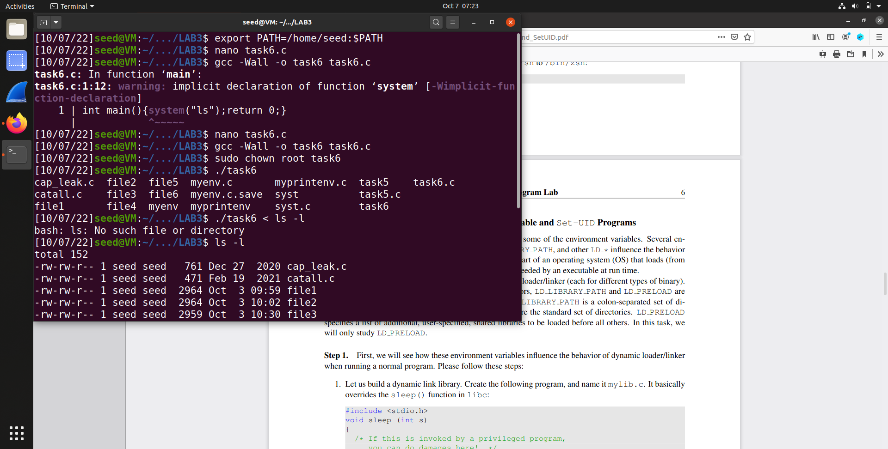
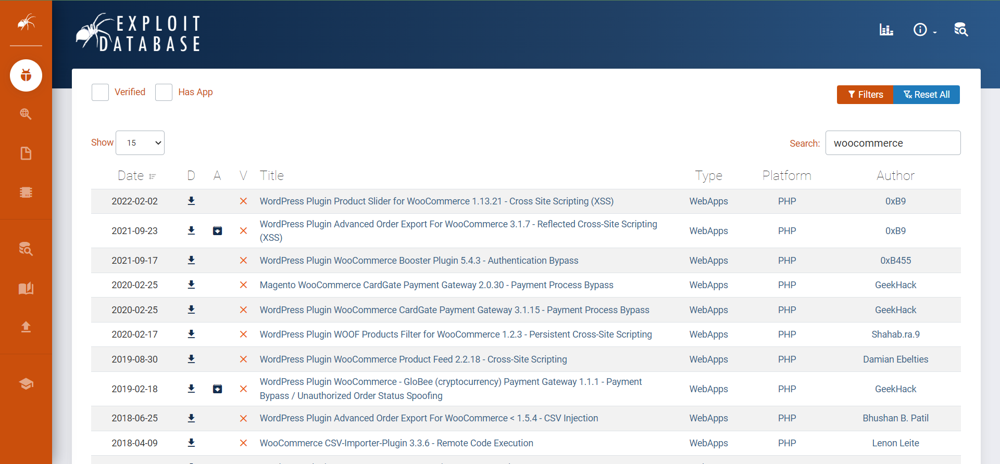
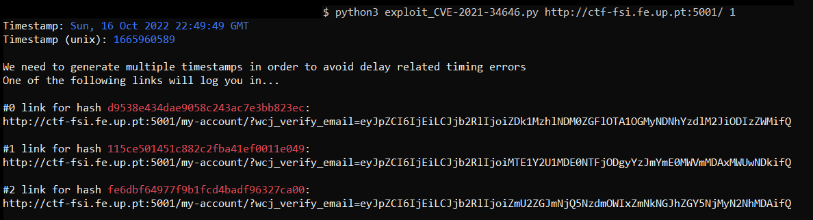
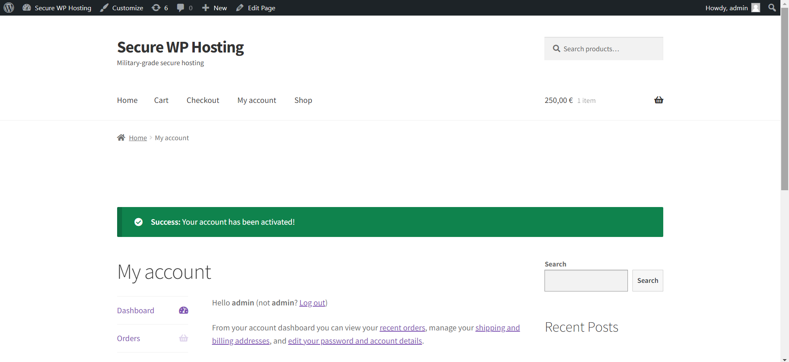

# Task 1

printenv result 

    SHELL=/bin/bash
    SESSION_MANAGER=local/VM:@/tmp/.ICE-unix/2079,unix/VM:/tmp/.ICE-unix/2079
    QT_ACCESSIBILITY=1
    COLORTERM=truecolor
    XDG_CONFIG_DIRS=/etc/xdg/xdg-ubuntu:/etc/xdg
    XDG_MENU_PREFIX=gnome-
    GNOME_DESKTOP_SESSION_ID=this-is-deprecated
    GNOME_SHELL_SESSION_MODE=ubuntu
    SSH_AUTH_SOCK=/run/user/1000/keyring/ssh
    XMODIFIERS=@im=ibus
    DESKTOP_SESSION=ubuntu
    SSH_AGENT_PID=2021
    GTK_MODULES=gail:atk-bridge
    PWD=/home/seed
    LOGNAME=seed
    XDG_SESSION_DESKTOP=ubuntu
    XDG_SESSION_TYPE=x11
    GPG_AGENT_INFO=/run/user/1000/gnupg/S.gpg-agent:0:1
    XAUTHORITY=/run/user/1000/gdm/Xauthority
    GJS_DEBUG_TOPICS=JS ERROR;JS LOG
    WINDOWPATH=2
    HOME=/home/seed
    USERNAME=seed
    IM_CONFIG_PHASE=1
    LANG=en_US.UTF-8
    LS_COLORS=rs=0:di=01;34:ln=01;36:mh=00:pi=40;33:so=01;35:do=01;35:bd=40;33;01:cd=40;33;01:or=40;31;01:mi=00:su=37;41:sg=30;43:ca=30;41:tw=30;42:ow=34;42:st=37;44:ex=01;32:*.tar=01;31:*.tgz=01;31:*.arc=01;31:*.arj=01;31:*.taz=01;31:*.lha=01;31:*.lz4=01;31:*.lzh=01;31:*.lzma=01;31:*.tlz=01;31:*.txz=01;31:*.tzo=01;31:*.t7z=01;31:*.zip=01;31:*.z=01;31:*.dz=01;31:*.gz=01;31:*.lrz=01;31:*.lz=01;31:*.lzo=01;31:*.xz=01;31:*.zst=01;31:*.tzst=01;31:*.bz2=01;31:*.bz=01;31:*.tbz=01;31:*.tbz2=01;31:*.tz=01;31:*.deb=01;31:*.rpm=01;31:*.jar=01;31:*.war=01;31:*.ear=01;31:*.sar=01;31:*.rar=01;31:*.alz=01;31:*.ace=01;31:*.zoo=01;31:*.cpio=01;31:*.7z=01;31:*.rz=01;31:*.cab=01;31:*.wim=01;31:*.swm=01;31:*.dwm=01;31:*.esd=01;31:*.jpg=01;35:*.jpeg=01;35:*.mjpg=01;35:*.mjpeg=01;35:*.gif=01;35:*.bmp=01;35:*.pbm=01;35:*.pgm=01;35:*.ppm=01;35:*.tga=01;35:*.xbm=01;35:*.xpm=01;35:*.tif=01;35:*.tiff=01;35:*.png=01;35:*.svg=01;35:*.svgz=01;35:*.mng=01;35:*.pcx=01;35:*.mov=01;35:*.mpg=01;35:*.mpeg=01;35:*.m2v=01;35:*.mkv=01;35:*.webm=01;35:*.ogm=01;35:*.mp4=01;35:*.m4v=01;35:*.mp4v=01;35:*.vob=01;35:*.qt=01;35:*.nuv=01;35:*.wmv=01;35:*.asf=01;35:*.rm=01;35:*.rmvb=01;35:*.flc=01;35:*.avi=01;35:*.fli=01;35:*.flv=01;35:*.gl=01;35:*.dl=01;35:*.xcf=01;35:*.xwd=01;35:*.yuv=01;35:*.cgm=01;35:*.emf=01;35:*.ogv=01;35:*.ogx=01;35:*.aac=00;36:*.au=00;36:*.flac=00;36:*.m4a=00;36:*.mid=00;36:*.midi=00;36:*.mka=00;36:*.mp3=00;36:*.mpc=00;36:*.ogg=00;36:*.ra=00;36:*.wav=00;36:*.oga=00;36:*.opus=00;36:*.spx=00;36:*.xspf=00;36:
    XDG_CURRENT_DESKTOP=ubuntu:GNOME
    VTE_VERSION=6003
    GNOME_TERMINAL_SCREEN=/org/gnome/Terminal/screen/3160a1c7_b5bc_4eb6_92e5_4bbdd7ab5b8f
    INVOCATION_ID=fb071e47b3e146bb924db572ef1c16f4
    MANAGERPID=1801
    GJS_DEBUG_OUTPUT=stderr
    LESSCLOSE=/usr/bin/lesspipe %s %s
    XDG_SESSION_CLASS=user
    TERM=xterm-256color
    LESSOPEN=| /usr/bin/lesspipe %s
    USER=seed
    GNOME_TERMINAL_SERVICE=:1.120
    DISPLAY=:0
    SHLVL=1
    QT_IM_MODULE=ibus
    XDG_RUNTIME_DIR=/run/user/1000
    JOURNAL_STREAM=9:36156
    XDG_DATA_DIRS=/usr/share/ubuntu:/usr/local/share/:/usr/share/:/var/lib/snapd/desktop
    PATH=/usr/local/sbin:/usr/local/bin:/usr/sbin:/usr/bin:/sbin:/bin:/usr/games:/usr/local/games:/snap/bin:.
    GDMSESSION=ubuntu
    DBUS_SESSION_BUS_ADDRESS=unix:path=/run/user/1000/bus
    _=/usr/bin/printenv

export result

    declare -x COLORTERM="truecolor"
    declare -x DBUS_SESSION_BUS_ADDRESS="unix:path=/run/user/1000/bus"
    declare -x DESKTOP_SESSION="ubuntu"
    declare -x DISPLAY=":0"
    declare -x GDMSESSION="ubuntu"
    declare -x GJS_DEBUG_OUTPUT="stderr"
    declare -x GJS_DEBUG_TOPICS="JS ERROR;JS LOG"
    declare -x GNOME_DESKTOP_SESSION_ID="this-is-deprecated"
    declare -x GNOME_SHELL_SESSION_MODE="ubuntu"
    declare -x GNOME_TERMINAL_SCREEN="/org/gnome/Terminal/screen/3160a1c7_b5bc_4eb6_92e5_4bbdd7ab5b8f"
    declare -x GNOME_TERMINAL_SERVICE=":1.120"
    declare -x GPG_AGENT_INFO="/run/user/1000/gnupg/S.gpg-agent:0:1"
    declare -x GTK_MODULES="gail:atk-bridge"
    declare -x HOME="/home/seed"
    declare -x IM_CONFIG_PHASE="1"
    declare -x INVOCATION_ID="fb071e47b3e146bb924db572ef1c16f4"
    declare -x JOURNAL_STREAM="9:36156"
    declare -x LANG="en_US.UTF-8"
    declare -x LESSCLOSE="/usr/bin/lesspipe %s %s"
    declare -x LESSOPEN="| /usr/bin/lesspipe %s"
    declare -x LOGNAME="seed"
    declare -x LS_COLORS="rs=0:di=01;34:ln=01;36:mh=00:pi=40;33:so=01;35:do=01;35:bd=40;33;01:cd=40;33;01:or=40;31;01:mi=00:su=37;41:sg=30;43:ca=30;41:tw=30;42:ow=34;42:st=37;44:ex=01;32:*.tar=01;31:*.tgz=01;31:*.arc=01;31:*.arj=01;31:*.taz=01;31:*.lha=01;31:*.lz4=01;31:*.lzh=01;31:*.lzma=01;31:*.tlz=01;31:*.txz=01;31:*.tzo=01;31:*.t7z=01;31:*.zip=01;31:*.z=01;31:*.dz=01;31:*.gz=01;31:*.lrz=01;31:*.lz=01;31:*.lzo=01;31:*.xz=01;31:*.zst=01;31:*.tzst=01;31:*.bz2=01;31:*.bz=01;31:*.tbz=01;31:*.tbz2=01;31:*.tz=01;31:*.deb=01;31:*.rpm=01;31:*.jar=01;31:*.war=01;31:*.ear=01;31:*.sar=01;31:*.rar=01;31:*.alz=01;31:*.ace=01;31:*.zoo=01;31:*.cpio=01;31:*.7z=01;31:*.rz=01;31:*.cab=01;31:*.wim=01;31:*.swm=01;31:*.dwm=01;31:*.esd=01;31:*.jpg=01;35:*.jpeg=01;35:*.mjpg=01;35:*.mjpeg=01;35:*.gif=01;35:*.bmp=01;35:*.pbm=01;35:*.pgm=01;35:*.ppm=01;35:*.tga=01;35:*.xbm=01;35:*.xpm=01;35:*.tif=01;35:*.tiff=01;35:*.png=01;35:*.svg=01;35:*.svgz=01;35:*.mng=01;35:*.pcx=01;35:*.mov=01;35:*.mpg=01;35:*.mpeg=01;35:*.m2v=01;35:*.mkv=01;35:*.webm=01;35:*.ogm=01;35:*.mp4=01;35:*.m4v=01;35:*.mp4v=01;35:*.vob=01;35:*.qt=01;35:*.nuv=01;35:*.wmv=01;35:*.asf=01;35:*.rm=01;35:*.rmvb=01;35:*.flc=01;35:*.avi=01;35:*.fli=01;35:*.flv=01;35:*.gl=01;35:*.dl=01;35:*.xcf=01;35:*.xwd=01;35:*.yuv=01;35:*.cgm=01;35:*.emf=01;35:*.ogv=01;35:*.ogx=01;35:*.aac=00;36:*.au=00;36:*.flac=00;36:*.m4a=00;36:*.mid=00;36:*.midi=00;36:*.mka=00;36:*.mp3=00;36:*.mpc=00;36:*.ogg=00;36:*.ra=00;36:*.wav=00;36:*.oga=00;36:*.opus=00;36:*.spx=00;36:*.xspf=00;36:"
    declare -x MANAGERPID="1801"
    declare -x OLDPWD
    declare -x PATH="/usr/local/sbin:/usr/local/bin:/usr/sbin:/usr/bin:/sbin:/bin:/usr/games:/usr/local/games:/snap/bin:."
    declare -x PWD="/home/seed"
    declare -x QT_ACCESSIBILITY="1"
    declare -x QT_IM_MODULE="ibus"
    declare -x SESSION_MANAGER="local/VM:@/tmp/.ICE-unix/2079,unix/VM:/tmp/.ICE-unix/2079"
    declare -x SHELL="/bin/bash"
    declare -x SHLVL="1"
    declare -x SSH_AGENT_PID="2021"
    declare -x SSH_AUTH_SOCK="/run/user/1000/keyring/ssh"
    declare -x TERM="xterm-256color"
    declare -x USER="seed"
    declare -x USERNAME="seed"
    declare -x VTE_VERSION="6003"
    declare -x WINDOWPATH="2"
    declare -x XAUTHORITY="/run/user/1000/gdm/Xauthority"
    declare -x XDG_CONFIG_DIRS="/etc/xdg/xdg-ubuntu:/etc/xdg"
    declare -x XDG_CURRENT_DESKTOP="ubuntu:GNOME"
    declare -x XDG_DATA_DIRS="/usr/share/ubuntu:/usr/local/share/:/usr/share/:/var/lib/snapd/desktop"
    declare -x XDG_MENU_PREFIX="gnome-"
    declare -x XDG_RUNTIME_DIR="/run/user/1000"
    declare -x XDG_SESSION_CLASS="user"
    declare -x XDG_SESSION_DESKTOP="ubuntu"
    declare -x XDG_SESSION_TYPE="x11"
    declare -x XMODIFIERS="@im=ibus"

# TASK 2

diff file1 file2 command did not print anything to the shell, therefore there is no difference between file1 and file2. This implies that the environment variables of the parent process are the same as the environment variables of the child process.

# TASK 3
 
Similarly to TASK 2, there was no difference between file3 and file4, meaning that when a new program is invoked by execve(), environment variables are automatically inherited

# TASK 4

GJS_DEBUG_TOPICS=JS ERROR;JS LOG
LESSOPEN=| /usr/bin/lesspipe %s
USER=seed
SSH_AGENT_PID=1931
XDG_SESSION_TYPE=x11
SHLVL=1
HOME=/home/seed
OLDPWD=/home/seed/Desktop
DESKTOP_SESSION=ubuntu
GNOME_SHELL_SESSION_MODE=ubuntu
GTK_MODULES=gail:atk-bridge
MANAGERPID=1730
DBUS_SESSION_BUS_ADDRESS=unix:path=/run/user/1000/bus
COLORTERM=truecolor
IM_CONFIG_PHASE=1
LOGNAME=seed
JOURNAL_STREAM=9:34163
_=./a.out
XDG_SESSION_CLASS=user
USERNAME=seed
TERM=xterm-256color
GNOME_DESKTOP_SESSION_ID=this-is-deprecated
WINDOWPATH=2
PATH=/usr/local/sbin:/usr/local/bin:/usr/sbin:/usr/bin:/sbin:/bin:/usr/games:/usr/local/games:/snap/bin:.
SESSION_MANAGER=local/VM:@/tmp/.ICE-unix/1974,unix/VM:/tmp/.ICE-unix/1974
INVOCATION_ID=04d8948610704a06bf58f91348cabe79
XDG_MENU_PREFIX=gnome-
GNOME_TERMINAL_SCREEN=/org/gnome/Terminal/screen/a49f7d30_10d2_43c5_8680_a672085ffe39
XDG_RUNTIME_DIR=/run/user/1000
DISPLAY=:0
LANG=en_US.UTF-8
XDG_CURRENT_DESKTOP=ubuntu:GNOME
XMODIFIERS=@im=ibus
XDG_SESSION_DESKTOP=ubuntu
XAUTHORITY=/run/user/1000/gdm/Xauthority
LS_COLORS=rs=0:di=01;34:ln=01;36:mh=00:pi=40;33:so=01;35:do=01;35:bd=40;33;01:cd=40;33;01:or=40;31;01:mi=00:su=37;41:sg=30;43:ca=30;41:tw=30;42:ow=34;42:st=37;44:ex=01;32:*.tar=01;31:*.tgz=01;31:*.arc=01;31:*.arj=01;31:*.taz=01;31:*.lha=01;31:*.lz4=01;31:*.lzh=01;31:*.lzma=01;31:*.tlz=01;31:*.txz=01;31:*.tzo=01;31:*.t7z=01;31:*.zip=01;31:*.z=01;31:*.dz=01;31:*.gz=01;31:*.lrz=01;31:*.lz=01;31:*.lzo=01;31:*.xz=01;31:*.zst=01;31:*.tzst=01;31:*.bz2=01;31:*.bz=01;31:*.tbz=01;31:*.tbz2=01;31:*.tz=01;31:*.deb=01;31:*.rpm=01;31:*.jar=01;31:*.war=01;31:*.ear=01;31:*.sar=01;31:*.rar=01;31:*.alz=01;31:*.ace=01;31:*.zoo=01;31:*.cpio=01;31:*.7z=01;31:*.rz=01;31:*.cab=01;31:*.wim=01;31:*.swm=01;31:*.dwm=01;31:*.esd=01;31:*.jpg=01;35:*.jpeg=01;35:*.mjpg=01;35:*.mjpeg=01;35:*.gif=01;35:*.bmp=01;35:*.pbm=01;35:*.pgm=01;35:*.ppm=01;35:*.tga=01;35:*.xbm=01;35:*.xpm=01;35:*.tif=01;35:*.tiff=01;35:*.png=01;35:*.svg=01;35:*.svgz=01;35:*.mng=01;35:*.pcx=01;35:*.mov=01;35:*.mpg=01;35:*.mpeg=01;35:*.m2v=01;35:*.mkv=01;35:*.webm=01;35:*.ogm=01;35:*.mp4=01;35:*.m4v=01;35:*.mp4v=01;35:*.vob=01;35:*.qt=01;35:*.nuv=01;35:*.wmv=01;35:*.asf=01;35:*.rm=01;35:*.rmvb=01;35:*.flc=01;35:*.avi=01;35:*.fli=01;35:*.flv=01;35:*.gl=01;35:*.dl=01;35:*.xcf=01;35:*.xwd=01;35:*.yuv=01;35:*.cgm=01;35:*.emf=01;35:*.ogv=01;35:*.ogx=01;35:*.aac=00;36:*.au=00;36:*.flac=00;36:*.m4a=00;36:*.mid=00;36:*.midi=00;36:*.mka=00;36:*.mp3=00;36:*.mpc=00;36:*.ogg=00;36:*.ra=00;36:*.wav=00;36:*.oga=00;36:*.opus=00;36:*.spx=00;36:*.xspf=00;36:
GNOME_TERMINAL_SERVICE=:1.153
SSH_AUTH_SOCK=/run/user/1000/keyring/ssh
SHELL=/bin/bash
QT_ACCESSIBILITY=1
GDMSESSION=ubuntu
LESSCLOSE=/usr/bin/lesspipe %s %s
GPG_AGENT_INFO=/run/user/1000/gnupg/S.gpg-agent:0:1
GJS_DEBUG_OUTPUT=stderr
QT_IM_MODULE=ibus
PWD=/home/seed/Desktop/Labsetup
XDG_CONFIG_DIRS=/etc/xdg/xdg-ubuntu:/etc/xdg
XDG_DATA_DIRS=/usr/share/ubuntu:/usr/local/share/:/usr/share/:/var/lib/snapd/desktop
VTE_VERSION=6003

# TASK 5 

As we can see, when defined the variables in the parent process, it passes to the child by printing out in the shell.

# TASK 6

neste aqui talvez se eu tivesse na diretoria em que estou um executavel chamado "ls" executava esse ao inves de /bin/ls

# CTF

## Desafio 1
Abrindo o endereço do servidor de Wordpress, podemos ver os comentários recentes que nos levam às reviews, na qual o admin refere que o wordpress é seguro, ou seja, o problema será dos pluggins usados. Na secção 'Additional information', tem informação acerca desses pluggins, o WooCommerce e o Booster for WooCommerce, e respetivas versões. Investigando os resultados que aparecem acerca destes pluggins na exploit database, surgiu a **CVE 2021-34646** que nos saltou à vista por referir uma vulnerabilidade exatamente na versão 5.4.3 do Booster, na qual a autenticação é ignorada - ver site => [https://www.exploit-db.com/exploits/50299]

## Desafio 2
Seguindo os passos descritos na página web da CVE mencionada no Desafio 1, 

1.  [http://ctf-fsi.fe.up.pt:5001/wp-json/wp/v2/users/] -> escolher o admin - user com id 1

2.  guardar o código e executar o ficheiro .py na linha de comando

3.  ver os links (um deles contém a flag)

