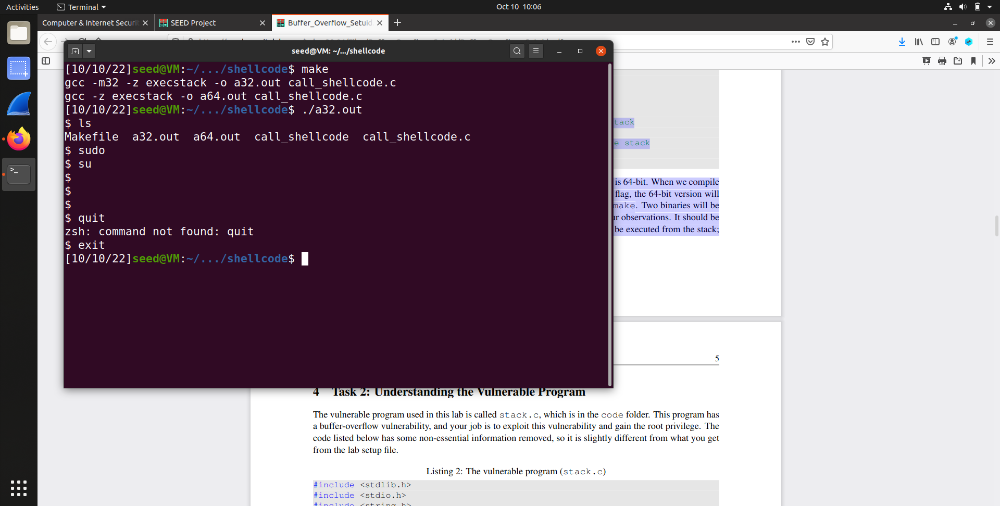
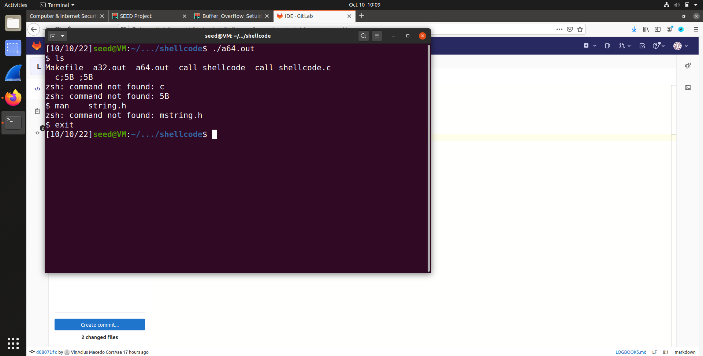
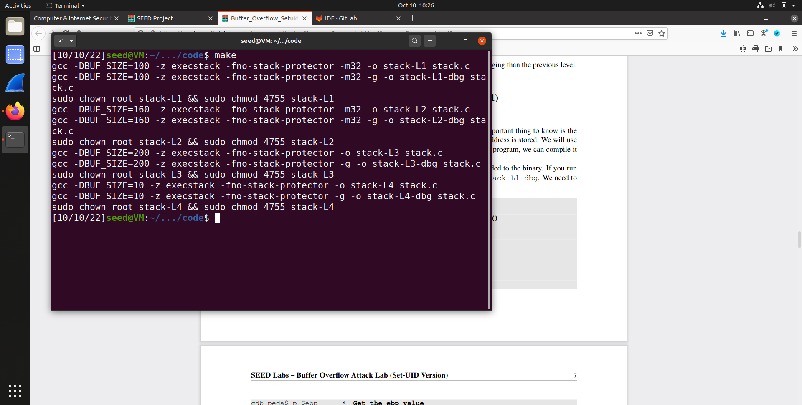
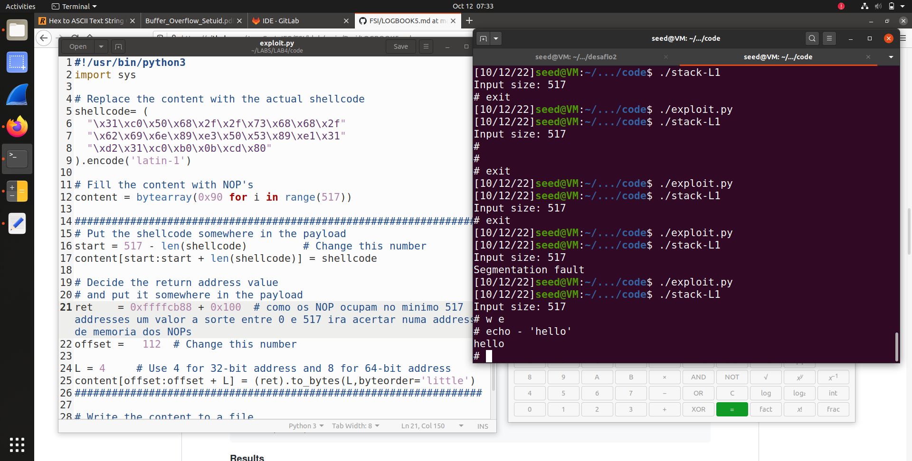
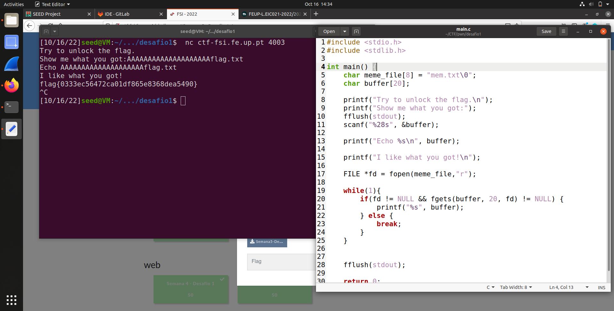
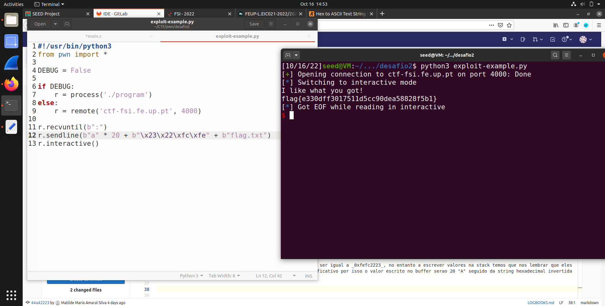

## TASK 1

- Resultado do programa de 32bit

- Resultado do probrama de 64bit

- Em ambos os programas 'e invocada uma nova shell, na qual se torna possivel executar shell code malicioso, e nao e possivel eliminar caracteres

## TASK 2 

- O comando _make_ deu print na consola ao seguinte

## TASK 3

- neste caso a address do base pointer e igual a _0xffffcb88_ e a do buffer e _0xffffca7c_, pelo que a distancia entre os dois e igual a 0x10C

# CTF

## Desafio 1
Apos ver o codigo fonte, e facil perceber que a string meme_file pode ser re-escrita dando overflow ao buffer, visto que na stack estas duas estruturas estao juntas. Por isso basta escrever 20 "A" seguido do nome do ficheiro que queremos de facto ler.

## Desafio 2

Desta vez, existe mais uma estrutura de dados entre meme_file e buffer, val. Para prevenir contra re-escrita da variavel, o valor da mesma e verificada durante a execucao do codigo. Porem, isto nao e uma boa prevencao pois basta escrever em buffer uma string que no local certo seja igual ao valor pretendido de val. 
Observando o codigo de main.c verificamos que val precisa de ser igual a _0xfefc2223_, no entanto a escrever valores na stack temos que nos lembrar que eles sao lidos do byte mais significativo para o byte menos significativo por isso o valor escrito no buffer serao 20 "A" seguido da string hexadecimal invertida seguido de flag.txt.

