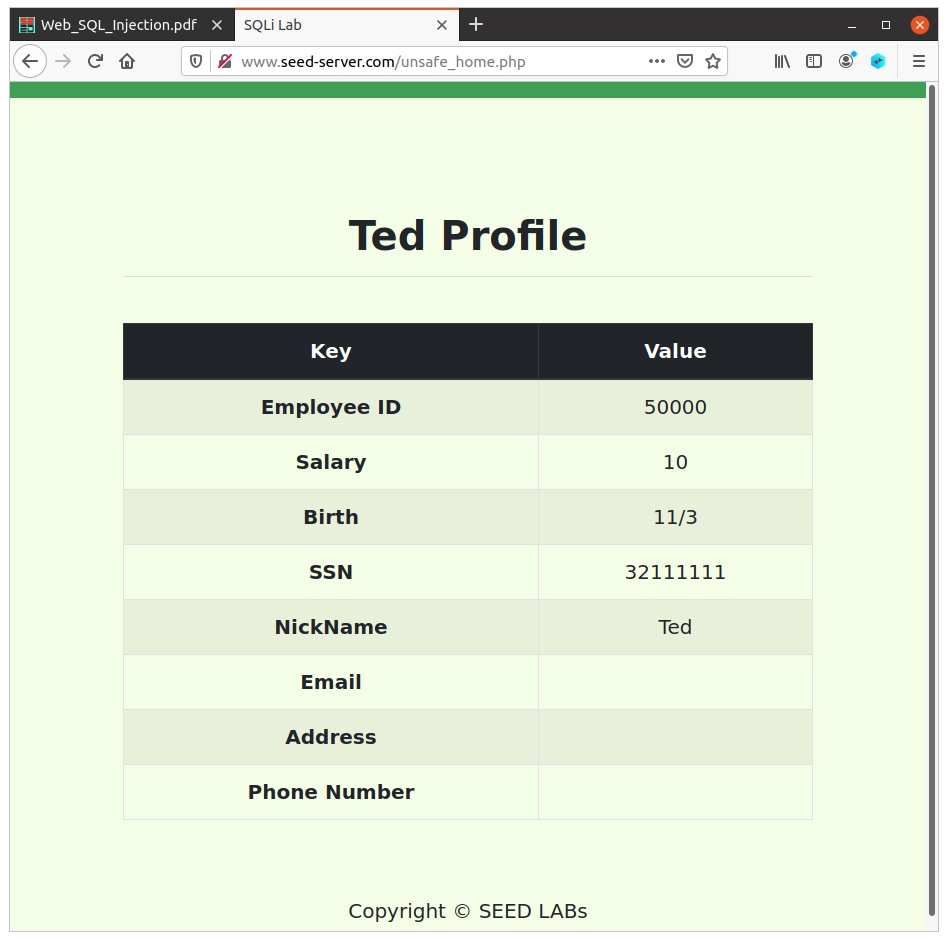

# LOGBOOK8

## TASK 1

Para verificar se o IP de http://www.seed-server.com estava, de facto, registado, executámos o comando ```cat /etc/hosts```. Após uma breve análise verificamos que não havia qualquer instância do link no ficheiro, por isso, usámos o comando ```sudo nano /etc/hosts``` e adicionámos no final do ficheiro "10.9.0.5        www.seed-server.com".
 


## TASK 2

### task 2.1


### task 2.2


## task 2.3


Após uma pesquisa online, no website de mysql, é dito: 

"The multiple statement and result capabilities can be used only with mysql_real_query() or mysql_query(). They cannot be used with the prepared statement interface. Prepared statement handlers are defined to work only with strings that contain a single statement. See Chapter 6, C API Prepared Statement Interface."

Portanto, a execução de duas queries nesta situação não é possível usando a interface de mysql no website.


## TASK 3

### task 3.1

statement injetada: Ted', Salary = '10' WHERE EID='50000'; #



### task 3.2
statement injetada: Boby', Salary = '1' WHERE EID='20000'; #


### task 3.3
statement injetada: Boby', Password = '7110eda4d09e062aa5e4a390b0a572ac0d2c0220' WHERE EID='20000'; #


# CTF - WriteUp

## Desafio 1

Após ver o código de index.php , verifica-se que existe uma vulnerabilidade do tipo SQL injection na linha 40. 


De forma semelhante à Task 2.1 do lab desta semana, o código a injetar é ``` admin'; -- ```.


Assim, conseguimos fazer login como admin e obter a flag:


## Desafio 2

Primeiro que tudo, analisar o código de main.c . Após tal, verificamos que o código dá print da address do buffer. Não existe mais nenhum ponto de entrada no programa pelo que, a estratégia adotada será um ataque de buffer overflow, especificamente injetar uma shell.


Portanto, vamos ter de calcular a posição de memória na qual injetamos o shellcode.

Como na stack do programa a unica variável que é guardada é buffer, o frame pointer estará imediatamente antes deste e o return value 8 bytes (arquitetura de 32-bits) acima do frame pointer. Portanto, para injetar a shell vamos ter que criar uma string que contenha o shellcode (retirado de um LOGBOOK anterior, com 23 bytes) + 77 bytes de chars (indiferente quais), para preencher os 100 bytes do buffer, após estes, quaisquer 8 bytes sobre o frame pointer, e por último a address de buffer que obtemos atravémos do printf. Assim o return address da função será buffer e o shellcode será executado. 


Corremos o script python e sucesso! Temos uma shell, pelo que basta fazer ```cat flag.txt``` e obter o valor da flag. 


